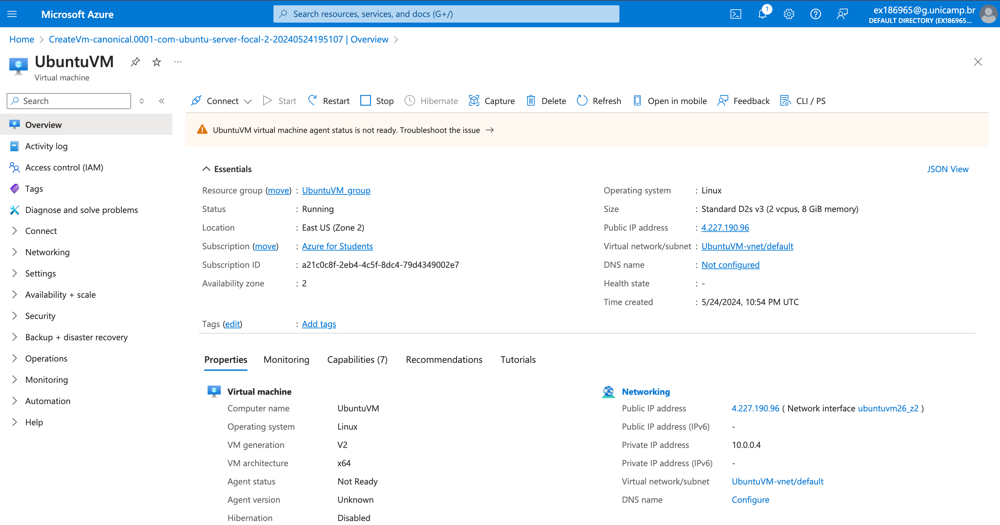
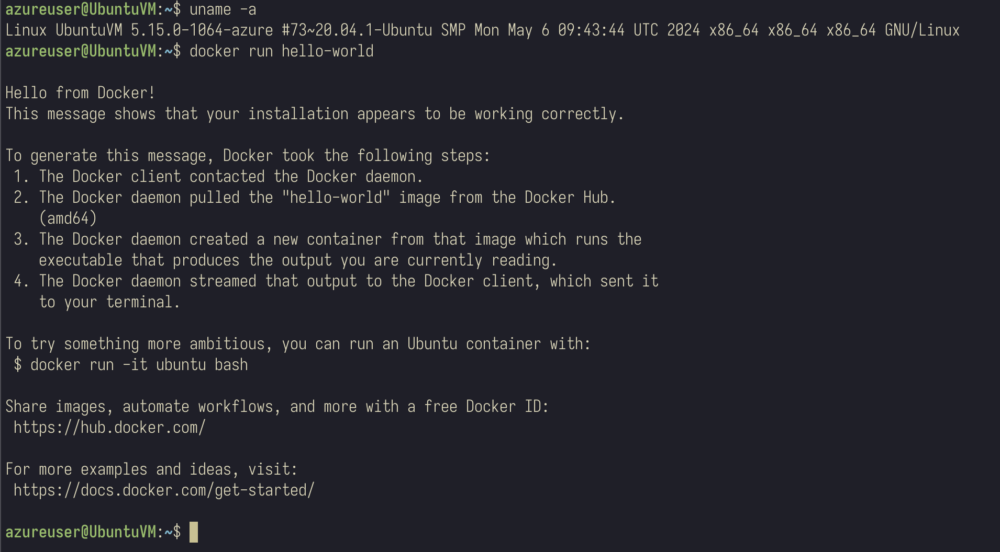
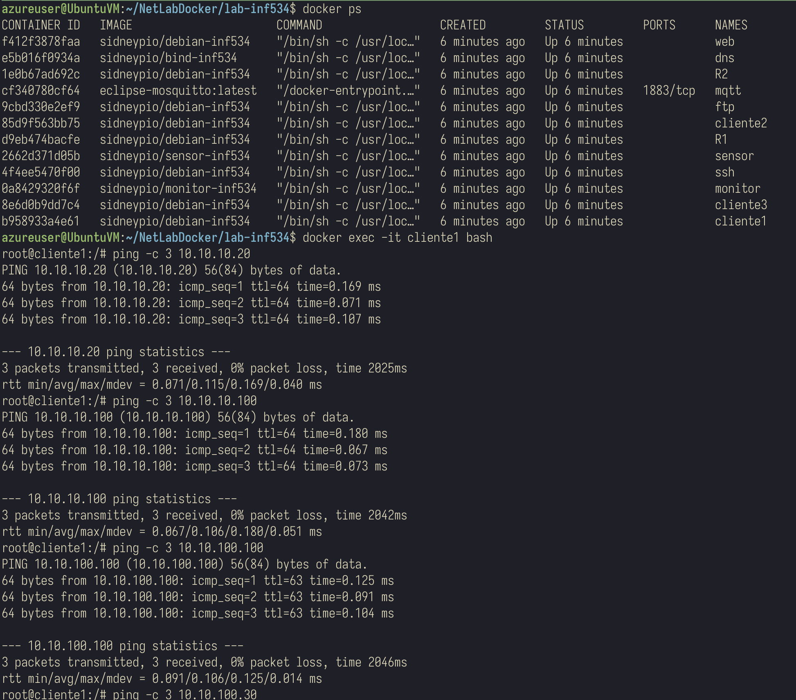

# Laborário 1

**Aluno**: Guilherme Rodriguez Vicentin
**E-mail**: vicentingr@gmail.com

## Objetivos

O objetivo desta atividade é preparar e testar o ambiente que será utilizado durante a disciplina. Para isso, iremos utilizar uma máquina virtual criada na Azure, que disponibiliza U$ 100,00 de crédito para contas com o e-mail acadêmico.

## Criação da Máquina Virtual

Através do console da Azure, iremos criar uma máquina virtual e configurar o acesso SSH para a mesma. O resultado final pode ser observado na Figura 1.



## 1. Configuração do Ambiente

Para configurar o ambiente, iremos instalar o Docker e o Docker Compose. Para isso, utilizaremos os seguintes comandos:

1. Atualizar o indíce de pacotes.
2. Baixar a chave do repositorio do Docker.
3. Adicionar a chave baixada no apt do Ubuntu.

```bash
# Download da chave do repositório do Docker
sudo apt-get update
sudo apt-get install ca-certificates curl
sudo install -m 0755 -d /etc/apt/keyrings
sudo curl -fsSL https://download.docker.com/linux/ubuntu/gpg -o /etc/apt/keyrings/docker.asc
sudo chmod a+r /etc/apt/keyrings/docker.asc

# Adiciona nova chave ao repositório do apt
echo \
  "deb [arch=$(dpkg --print-architecture) signed-by=/etc/apt/keyrings/docker.asc] https://download.docker.com/linux/ubuntu \
  $(. /etc/os-release && echo "$VERSION_CODENAME") stable" | \
  sudo tee /etc/apt/sources.list.d/docker.list > /dev/null
sudo apt-get update
```

4. Instalar o Docker e o Docker Compose.

```bash
sudo apt-get install docker-ce docker-ce-cli containerd.io docker-buildx-plugin docker-compose-plugin
```

5. Verificar se a instalação foi bem sucedida.

```bash
sudo docker run hello-world
```

6. Opicional: adicionar o usuário ao grupo do Docker. Desta forma, não será necessário utilizar o sudo para executar comandos do Docker.

```bash
sudo groupadd docker
sudo usermod -aG docker $USER
```

Na figura a seguir podemos ver o comando docker run hello-world sendo executado com sucesso.



## 2. Teste do Ambiente

Para testar o ambiente, iremos primeiramente realizar o clone do projeto e em seguida, executar o comando docker-compose up disponibilizado através do `make liga`.

O comando `docker-compose up` é responsável por subir todos os containers definidos no arquivo `docker-compose.yml`. O comando `make liga` é um atalho para o comando `docker-compose up -d`.

```bash
# Garantindo a instalação das dependências
sudo apt-get install build-essential gcc

# Clone do projeto
git clone https://github.com/sidneypio/NetLabDocker.git
cd NetLabDocker/lab-inf534/

# Sobe os containers docker
make liga 
```

Apos a execução do comando, podemos visualizar os containers rodando no nosso ambiente.

```bash
$ docker ps
CONTAINER ID   IMAGE                      COMMAND                  CREATED              STATUS              PORTS      NAMES
f412f3878faa   sidneypio/debian-inf534    "/bin/sh -c /usr/loc…"   About a minute ago   Up About a minute              web
e5b016f0934a   sidneypio/bind-inf534      "/bin/sh -c /usr/loc…"   About a minute ago   Up About a minute              dns
1e0b67ad692c   sidneypio/debian-inf534    "/bin/sh -c /usr/loc…"   About a minute ago   Up About a minute              R2
cf340780cf64   eclipse-mosquitto:latest   "/docker-entrypoint.…"   About a minute ago   Up About a minute   1883/tcp   mqtt
9cbd330e2ef9   sidneypio/debian-inf534    "/bin/sh -c /usr/loc…"   About a minute ago   Up About a minute              ftp
85d9f563bb75   sidneypio/debian-inf534    "/bin/sh -c /usr/loc…"   About a minute ago   Up About a minute              cliente2
d9eb474bacfe   sidneypio/debian-inf534    "/bin/sh -c /usr/loc…"   About a minute ago   Up About a minute              R1
2662d371d05b   sidneypio/sensor-inf534    "/bin/sh -c /usr/loc…"   About a minute ago   Up About a minute              sensor
4f4ee5470f00   sidneypio/debian-inf534    "/bin/sh -c /usr/loc…"   About a minute ago   Up About a minute              ssh
0a8429320f6f   sidneypio/monitor-inf534   "/bin/sh -c /usr/loc…"   About a minute ago   Up About a minute              monitor
8e6d0b9dd7c4   sidneypio/debian-inf534    "/bin/sh -c /usr/loc…"   About a minute ago   Up About a minute              cliente3
b958933a4e61   sidneypio/debian-inf534    "/bin/sh -c /usr/loc…"   About a minute ago   Up About a minute              cliente1
```

Vamos então utilizar um shell criado no container cliente1 para verificar a conectividade com os demais containers na mesma rede. Os comandos utilizados, junto com suas respectivas saídas, podem ser observados a seguir.

```bash 
$ docker exec -it cliente1 bash
root@cliente1:/# ping -c 3 10.10.10.20
PING 10.10.10.20 (10.10.10.20) 56(84) bytes of data.
64 bytes from 10.10.10.20: icmp_seq=1 ttl=64 time=0.169 ms
64 bytes from 10.10.10.20: icmp_seq=2 ttl=64 time=0.071 ms
64 bytes from 10.10.10.20: icmp_seq=3 ttl=64 time=0.107 ms

--- 10.10.10.20 ping statistics ---
3 packets transmitted, 3 received, 0% packet loss, time 2025ms
rtt min/avg/max/mdev = 0.071/0.115/0.169/0.040 ms
root@cliente1:/# ping -c 3 10.10.10.100
PING 10.10.10.100 (10.10.10.100) 56(84) bytes of data.
64 bytes from 10.10.10.100: icmp_seq=1 ttl=64 time=0.180 ms
64 bytes from 10.10.10.100: icmp_seq=2 ttl=64 time=0.067 ms
64 bytes from 10.10.10.100: icmp_seq=3 ttl=64 time=0.073 ms

--- 10.10.10.100 ping statistics ---
3 packets transmitted, 3 received, 0% packet loss, time 2042ms
rtt min/avg/max/mdev = 0.067/0.106/0.180/0.051 ms
root@cliente1:/# ping -c 3 10.10.100.100
PING 10.10.100.100 (10.10.100.100) 56(84) bytes of data.
64 bytes from 10.10.100.100: icmp_seq=1 ttl=63 time=0.125 ms
64 bytes from 10.10.100.100: icmp_seq=2 ttl=63 time=0.091 ms
64 bytes from 10.10.100.100: icmp_seq=3 ttl=63 time=0.104 ms

--- 10.10.100.100 ping statistics ---
3 packets transmitted, 3 received, 0% packet loss, time 2046ms
rtt min/avg/max/mdev = 0.091/0.106/0.125/0.014 ms
root@cliente1:/# ping -c 3 10.10.100.30
PING 10.10.100.30 (10.10.100.30) 56(84) bytes of data.
64 bytes from 10.10.100.30: icmp_seq=1 ttl=62 time=0.278 ms
64 bytes from 10.10.100.30: icmp_seq=2 ttl=62 time=0.101 ms
64 bytes from 10.10.100.30: icmp_seq=3 ttl=62 time=0.124 ms

--- 10.10.100.30 ping statistics ---
3 packets transmitted, 3 received, 0% packet loss, time 2051ms
rtt min/avg/max/mdev = 0.101/0.167/0.278/0.078 ms
root@cliente1:/#
```

O comando `ping -c 3 <ip>` foi utilizado para verificar a conectividade com os demais containers. Podemos observar que a conectividade foi bem sucedida para todos os containers. A figura a seguir mostra a execução do comando `ping -c 3`.



---

## Esforço para a realização deste Laboratório

1. Tempo alocado para a primeira etapa: 15 minutos
2. Tempo alocado para a segunda etapa: 20 minutos
