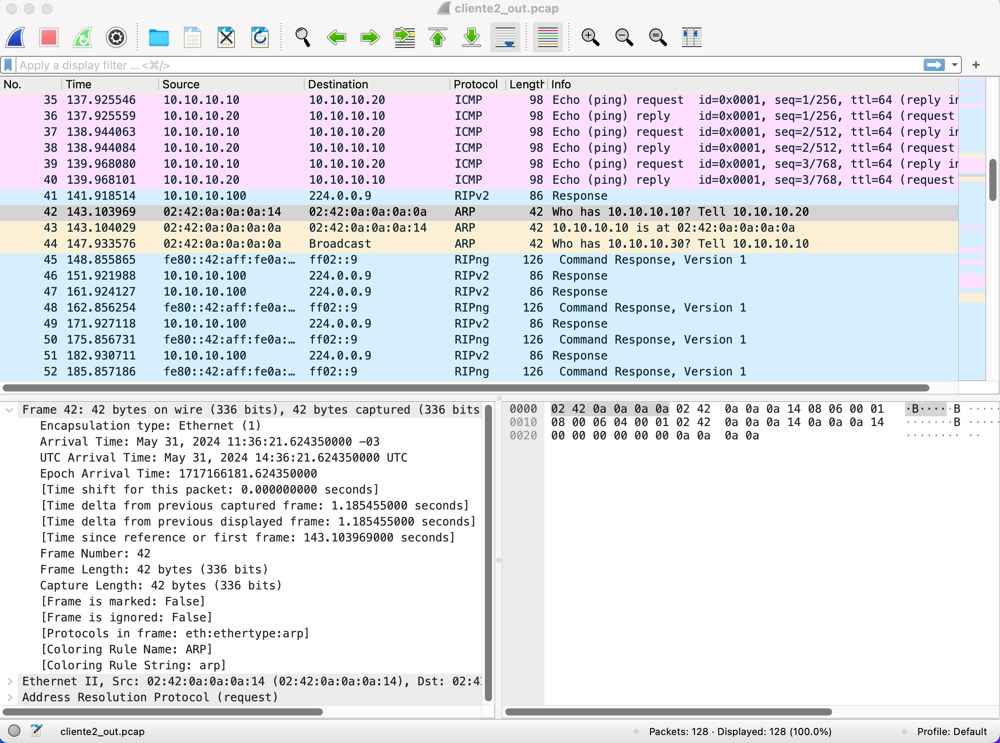

# Laboratório 2: Ethernet e ARP

**Aluno**: Guilherme Rodriguez Vicentin
**E-mail**: vicentingr@gmail.com

## Objetivos

1. Aprenda a modificar parâmetros de Ethernet.
2. Funcionamento do protocolo ARP
3. Testes com ARP estático e endereços especiais
4. Pacotes IP e sua utilização

## 1. Preparando o ambiente

Para começar, iremos rodar o `docker compose up -d` para subir o ambiente.


## 2 e 3. Monitorando os pacotes

Para os containers `cliente2` e `cliente3`, iremos monitorar os pacotes que chegam na interface `eth0`.

```bash
docker exec -d cliente2 tcpdump -ni eth0 -s 1024 -w arquivo_de_saida.pcap
docker exec -d cliente3 tcpdump -ni eth0 -s 1024 -w arquivo_de_saida.pcap
```

## 4. Testando conectividade

Agora, iremos testar a conectividade entre o container `cliente1` e os containers `cliente2` e `cliente3`.

```bash
$ docker exec -it cliente1 bash
root@cliente1:/# ping -c 3 10.10.10.20
PING 10.10.10.20 (10.10.10.20) 56(84) bytes of data.
64 bytes from 10.10.10.20: icmp_seq=1 ttl=64 time=0.132 ms
64 bytes from 10.10.10.20: icmp_seq=2 ttl=64 time=0.088 ms
64 bytes from 10.10.10.20: icmp_seq=3 ttl=64 time=0.083 ms

--- 10.10.10.20 ping statistics ---
3 packets transmitted, 3 received, 0% packet loss, time 2043ms
rtt min/avg/max/mdev = 0.083/0.101/0.132/0.022 ms
root@cliente1:/# ping -c 3 10.10.10.30
PING 10.10.10.30 (10.10.10.30) 56(84) bytes of data.
64 bytes from 10.10.10.30: icmp_seq=1 ttl=64 time=0.164 ms
64 bytes from 10.10.10.30: icmp_seq=2 ttl=64 time=0.086 ms
64 bytes from 10.10.10.30: icmp_seq=3 ttl=64 time=0.082 ms

--- 10.10.10.30 ping statistics ---
3 packets transmitted, 3 received, 0% packet loss, time 2050ms
rtt min/avg/max/mdev = 0.082/0.110/0.164/0.037 ms
```

## 5. Comando Ping

O comando `ping` aceita o argumento `-c` para definir o número de pacotes a serem enviados. Além dessa opção, o comando ping também aceita o argumento -s para definir o tamanho do pacote, o argumento -t para definir o TTL do pacote e o argumento -i para definir o intervalo entre os pacotes e o argumento -W para definir o tempo de espera para cada resposta.

A seguir, um exemplo de comando ping com os argumentos `-c, -s, -t, -i e -W`: 

```bash
root@cliente1:/# ping -c 3 -s 100 -t 64 -i 1 -W 1 10.10.10.20
PING 10.10.10.20 (10.10.10.20) 100(128) bytes of data.
108 bytes from 10.10.10.20: icmp_seq=1 ttl=64 time=0.087 ms
108 bytes from 10.10.10.20: icmp_seq=2 ttl=64 time=0.086 ms
108 bytes from 10.10.10.20: icmp_seq=3 ttl=64 time=0.128 ms

--- 10.10.10.20 ping statistics ---
3 packets transmitted, 3 received, 0% packet loss, time 2030ms
rtt min/avg/max/mdev = 0.086/0.100/0.128/0.019 ms
```

## 6. Finalizando a coleção de pacotes

Para finalizar a coleção de pacotes, basta executar o comando `kill` no `tcpdump` no container cliente2 e cliente3.

```bash
docker exec -it cliente2 killall tcpdump
docker exec -it cliente3 killall tcpdump
```

## 7. Analisando os pacotes

Primeiramente, antes de analisar os pacotes, como estamos utilizando uma máquina virtual, iremos trazer os arquivos de saída pra o host hospedeiro através do comando `scp`.

```bash
scp -i ~/.ssh/id_azure_ubuntu.pem azureuser@4.227.190.96:/home/azureuser/NetLabDocker/lab-inf534/home/cliente2/arquivo_de_saida.pcap cliente2_out.pcap
scp -i ~/.ssh/id_azure_ubuntu.pem azureuser@4.227.190.96:/home/azureuser/NetLabDocker/lab-inf534/home/cliente3/arquivo_de_saida.pcap cliente3_out.pcap
```

Na figura 2 e 3, podemos ver a análise dos pacotes capturados através do Wireshark.




A seguir, podemos tomar como exemplo um pacote ping capturado no cliente2.


Alguma estatísticas interessantes que podemos observar são:

```
==============================================================================================================================
IPv4 Statistics/All Addresses:
Topic / Item   Count         Average       Min Val       Max Val       Rate (ms)     Percent       Burst Rate    Burst Start  
------------------------------------------------------------------------------------------------------------------------------
All Addresses  56                                                      0.0001        100%          0.0200        139.742      
 224.0.0.9     50                                                      0.0001        89.29%        0.0100        1.704        
 10.10.10.30   6                                                       0.0000        10.71%        0.0200        139.742      
 10.10.10.100  50                                                      0.0001        89.29%        0.0100        1.704        
 10.10.10.10   6                                                       0.0000        10.71%        0.0200        139.742      

------------------------------------------------------------------------------------------------------------------------------
```

## 8. Tabela ARP

Podemos visualizar a tabela ARP do cliente1 através do comando `arp -n`.

```bash
root@cliente1:/# arp -n
Address                  HWtype  HWaddress           Flags Mask            Iface
10.10.10.20              ether   02:42:0a:0a:0a:14   C                     eth0
10.10.10.30              ether   02:42:0a:0a:0a:1e   C                     eth0
```

## 9. Limpando a tabela e analisando um pacote ARP

```bash
root@cliente1:/# ip neigh flush all
```

Pacote ARP capturado no cliente3. Podemos nota o IP e Mac de origem (cliente1) e destino (broadcast).

```
Address Resolution Protocol (request)
    Hardware type: Ethernet (1)
    Protocol type: IPv4 (0x0800)
    Hardware size: 6
    Protocol size: 4
    Opcode: request (1)
    Sender MAC address: 02:42:0a:0a:0a:0a (02:42:0a:0a:0a:0a)
    Sender IP address: 10.10.10.10
    Target MAC address: 00:00:00_00:00:00 (00:00:00:00:00:00)
    Target IP address: 10.10.10.30
```

Na resposta, podemos ver o IP e Mac de origem (cliente3) e destino (cliente1).

```
Address Resolution Protocol (reply)
    Hardware type: Ethernet (1)
    Protocol type: IPv4 (0x0800)
    Hardware size: 6
    Protocol size: 4
    Opcode: reply (2)
    Sender MAC address: 02:42:0a:0a:0a:1e (02:42:0a:0a:0a:1e)
    Sender IP address: 10.10.10.30
    Target MAC address: 02:42:0a:0a:0a:0a (02:42:0a:0a:0a:0a)
    Target IP address: 10.10.10.10
```

## 10. Mudando o MAC

Neste experimento, iremos primerio executar o `ping` do cliente1 para o cliente2. No primeiro momento, a tabela ARP está preenchida com o valor `02:42:0a:0a:0a:14` para o IP `10.10.10.20`.

```bash
docker exec cliente1 ping -c 3 10.10.10.20
PING 10.10.10.20 (10.10.10.20) 56(84) bytes of data.
64 bytes from 10.10.10.20: icmp_seq=1 ttl=64 time=0.086 ms
64 bytes from 10.10.10.20: icmp_seq=2 ttl=64 time=0.086 ms
64 bytes from 10.10.10.20: icmp_seq=3 ttl=64 time=0.083 ms

--- 10.10.10.20 ping statistics ---
3 packets transmitted, 3 received, 0% packet loss, time 2030ms
```

Agora, iremos mudar o MAC do cliente2 para `02:42:0a:0a:0a:bb` e executar o `ping` novamente.

```bash
root@cliente2:/# ip link set eth0 down
root@cliente2:/# ip link set eth0 address 02:42:0a:0a:0a:bb
root@cliente2:/# ip link set eth0 up
```

Agora, iremos executar o `ping` novamente. Dessa vez, não obtivemos sucesso. A tabela ARP está com o valor `incomplete` para o IP.

```bash
docker exec cliente1 ping -c 3 10.10.10.20
PING 10.10.10.20 (10.10.10.20) 56(84) bytes of data.

--- 10.10.10.20 ping statistics ---
3 packets transmitted, 0 received, 100% packet loss, time 2035ms
```

```bash
root@cliente1:/# arp -n
Address                  HWtype  HWaddress           Flags Mask            Iface
10.10.10.20                      (incomplete)                              eth0
10.10.10.30              ether   02:42:0a:0a:0a:1e   C                     eth0
```

Alguns minutos depois, a tabela ARP foi atualizada com o novo MAC e o ping funciona corretamente.

```bash
root@cliente1:/# arp -n
Address                  HWtype  HWaddress           Flags Mask            Iface
10.10.10.20              ether   02:42:0a:0a:0a:bb   C                     eth0
10.10.10.30              ether   02:42:0a:0a:0a:1e   C                     eth0
```

## 11. Dois IPs com o mesmo MAC

Neste experimento, iremos configurar o mesmo MAC nos cliente2 e cliente3. Ao executarmos o ping do cliente1 alguns pacotes são perdidos.

Podemos observar a tabela ARP do cliente1 com os dois IPs apontando para o mesmo MAC.

```bash
ping 10.10.10.20
PING 10.10.10.20 (10.10.10.20) 56(84) bytes of data.
64 bytes from 10.10.10.20: icmp_seq=3 ttl=64 time=0.109 ms
From 10.10.10.30 icmp_seq=2 Redirect Host(New nexthop: 10.10.10.20)
From 10.10.10.30 icmp_seq=1 Destination Host Unreachable
From 10.10.10.30 icmp_seq=2 Destination Host Unreachable
From 10.10.10.30 icmp_seq=5 Redirect Host(New nexthop: 10.10.10.20)
From 10.10.10.30 icmp_seq=6 Redirect Host(New nexthop: 10.10.10.20)
From 10.10.10.30 icmp_seq=4 Destination Host Unreachable
64 bytes from 10.10.10.20: icmp_seq=8 ttl=64 time=0.061 ms
64 bytes from 10.10.10.20: icmp_seq=9 ttl=64 time=0.065 ms
From 10.10.10.30 icmp_seq=7 Destination Host Unreachable
64 bytes from 10.10.10.20: icmp_seq=11 ttl=64 time=0.062 ms
64 bytes from 10.10.10.20: icmp_seq=12 ttl=64 time=0.061 ms
From 10.10.10.30 icmp_seq=10 Destination Host Unreachable
^C
--- 10.10.10.20 ping statistics ---
13 packets transmitted, 5 received, +8 errors, 61.5385% packet loss, time 12292ms
rtt min/avg/max/mdev = 0.061/0.071/0.109/0.018 ms, pipe 4
root@cliente1:/# arp -n
Address                  HWtype  HWaddress           Flags Mask            Iface
10.10.10.20              ether   02:42:0a:0a:0a:bb   C                     eth0
10.10.10.30              ether   02:42:0a:0a:0a:bb   C                     eth0
```

## 12. Operação noraml

Podemos observar que após a mudança do MAC do cliente2 e cliente3, o ping volta a funcionar corretamente.

Além disso, podemos fixar um MAC para o cliente1 e observar o funcionamento normal do ping.

## 13. Conclusão

Conseguimos observar o funcionamento do protocolo ARP e como ele é essencial para a comunicação entre os dispositivos em uma rede. Além disso, pudemos observar como a tabela ARP é atualizada e como o ping é afetado por mudanças no MAC dos dispositivos.

Além disto, percebemos como a manipulação do MAC pode afetar a comunicação entre os dispositivos e como o protocolo ARP é essencial para a comunicação entre os dispositivos em uma rede. E por este motivo, ataques como ARP Spoofing são tão eficazes.
