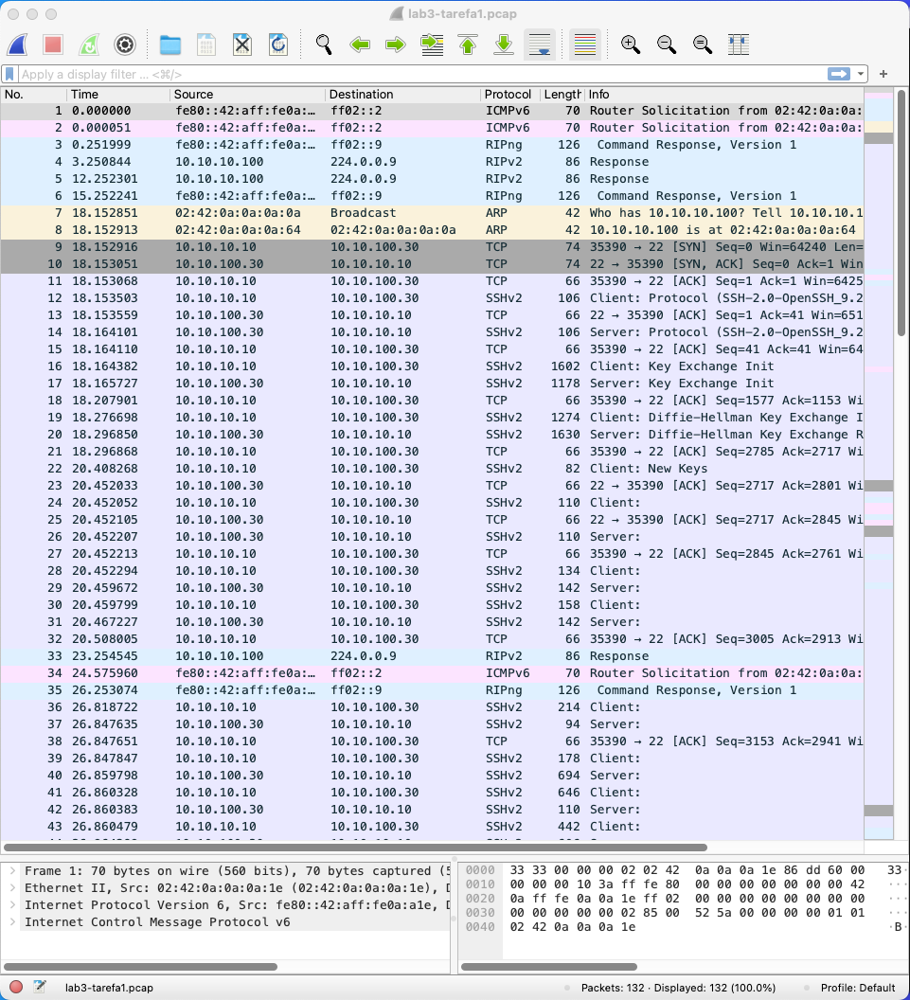

# Laboratório 3: IPv4 e ICMPv4

**Aluno**: Guilherme Rodriguez Vicentin
**E-mail**: vicentingr@gmail.com

## Tarefa 1

Primeiramente, iremos ativar o `tcpdump` no **cliente 1** e executar conexões 
utilizando `ssh` e `ftp`.

```bash
$ docker exec -it client1 bash

root@cliente1:/# tcpdump -i eth0 -w /home/lab3-tarefa1.pcap &
root@cliente1:/# ssh inf500@10.10.100.30 # senha: inf500
root@cliente1:/# ftp 10.10.100.20        # usuário: inf500, senha: inf500
```

Abaixo, temos a captura de tela do `tcpdump` no **cliente 1** no Wireshark:



Utilizando o programa iremos escolher um pacote de cada conexão e analisar o cabeçalho IP para análise:

```
Internet Protocol Version 4, Src: 10.10.10.10, Dst: 10.10.100.30
    0100 .... = Version: 4
    .... 0101 = Header Length: 20 bytes (5)
    Differentiated Services Field: 0x10 (DSCP: Unknown, ECN: Not-ECT)
    Total Length: 60
    Identification: 0xe038 (57400)
    010. .... = Flags: 0x2, Don't fragment
    ...0 0000 0000 0000 = Fragment Offset: 0
    Time to Live: 64
    Protocol: TCP (6)
    Header Checksum: 0xd837 [validation disabled]
    [Header checksum status: Unverified]
    Source Address: 10.10.10.10
    Destination Address: 10.10.100.30
```

- Id do pacote: 0xe038 (57400)
- Tempo de vida: 64
- QoS: 0x10 (DSCP: Unknown, ECN: Not-ECT)
- Fragmentação:
  - Flags: 0x2, Não fragmentar
  - Offset: 0

```
Internet Protocol Version 4, Src: 10.10.10.10, Dst: 10.10.100.20
    0100 .... = Version: 4
    .... 0101 = Header Length: 20 bytes (5)
    Differentiated Services Field: 0x10 (DSCP: Unknown, ECN: Not-ECT)
    Total Length: 65
    Identification: 0xc2f6 (49910)
    010. .... = Flags: 0x2, Don't fragment
    ...0 0000 0000 0000 = Fragment Offset: 0
    Time to Live: 64
    Protocol: TCP (6)
    Header Checksum: 0xf57e [validation disabled]
    [Header checksum status: Unverified]
    Source Address: 10.10.10.10
    Destination Address: 10.10.100.20
```

- Id do pacote: 0xc2f6 (49910)
- Tempo de vida: 64
- QoS: 0x10 (DSCP: Unknown, ECN: Not-ECT)
- Fragmentação:
  - Flags: 0x2, Não fragmentar
  - Offset: 0

## Tarefa 2

Agora, iremos ativar a monitoração no servidor ftp e executar o comando `ftp` no cliente 1.

```bash
$ docker exec -d ftp tcpdump -i eth0 -w /home/lab3-tarefa2.pcap

$ docker exec -it client1 bash

root@cliente1:/# ftp 10.10.100.20 # usuário: inf500, senha: inf500
ftp> ls
ftp> exit
root@client1:/# exit

$ docker exec -d ftp killall tcpdump
```

Abaixo, temos a captura de tela do `tcpdump` no **servidor ftp** no Wireshark:


Observando o cabeçalho IP dos pacotes, temos:

```
Internet Protocol Version 4, Src: 10.10.10.10, Dst: 10.10.100.20
    0100 .... = Version: 4
    .... 0101 = Header Length: 20 bytes (5)
    Differentiated Services Field: 0x00 (DSCP: CS0, ECN: Not-ECT)
    Total Length: 60
    Identification: 0xdabd (55997)
    010. .... = Flags: 0x2, Don't fragment
    ...0 0000 0000 0000 = Fragment Offset: 0
    Time to Live: 62
    Protocol: TCP (6)
    Header Checksum: 0xdfcc [validation disabled]
    [Header checksum status: Unverified]
    Source Address: 10.10.10.10
    Destination Address: 10.10.100.20
```

- Id do pacote: 0xdabd (55997)
- Tempo de vida: 62
- QoS: 0x00 (DSCP: CS0, ECN: Not-ECT)
- Fragmentação:
  - Flags: 0x2, Não fragmentar
  - Offset: 0

Podemos observar que o campo QoS foi alterado para `0x00 (CS0)` e o tempo de vida foi reduzido para `62`. O identificador do pacote também foi alterado pois executamos duas conexões diferentes.

## Tarefa 3

Iremos ativar a monitoração no **cliente 1** novamente e executar uma série de comandos ping:

```bash
$ docker exec -it client1 bash
root@cliente1:/# tcpdump -i eth0 -w /home/lab3-tarefa3.pcap &
root@cliente1:/# ping -c 5 -Q 184 -s 1024 10.10.100.30
root@cliente1:/# ping -c 5 -Q 40 -s 4096 10.10.100.30
root@cliente1:/# ping -c 5 -s 1024 -t 1 10.10.10.20
root@cliente1:/# ping -c 5 -s 1024 -t 1 10.10.100.20
root@cliente1:/# ping -c 5 -s 1024 -t 3 10.10.100.30
root@cliente1:/# ping -c 5 -s 512 -M do 10.10.100.10
root@cliente1:/# ping -c 5 -s 1473 -M do 10.10.100.10
```

Os resultados obtidos podem observados abaixo:

```bash
root@cliente1:/# ping -c 5 -Q 184 -s 1024 10.10.100.30
PING 10.10.100.30 (10.10.100.30) 1024(1052) bytes of data.
1032 bytes from 10.10.100.30: icmp_seq=1 ttl=62 time=0.192 ms
1032 bytes from 10.10.100.30: icmp_seq=2 ttl=62 time=0.109 ms
1032 bytes from 10.10.100.30: icmp_seq=3 ttl=62 time=0.164 ms
1032 bytes from 10.10.100.30: icmp_seq=4 ttl=62 time=0.108 ms
1032 bytes from 10.10.100.30: icmp_seq=5 ttl=62 time=0.109 ms

--- 10.10.100.30 ping statistics ---
5 packets transmitted, 5 received, 0% packet loss, time 4088ms
rtt min/avg/max/mdev = 0.108/0.136/0.192/0.035 ms
root@cliente1:/# ping -c 5 -Q 40 -s 4096 10.10.100.30
PING 10.10.100.30 (10.10.100.30) 4096(4124) bytes of data.
4104 bytes from 10.10.100.30: icmp_seq=1 ttl=62 time=0.209 ms
4104 bytes from 10.10.100.30: icmp_seq=2 ttl=62 time=0.271 ms
4104 bytes from 10.10.100.30: icmp_seq=3 ttl=62 time=0.263 ms
4104 bytes from 10.10.100.30: icmp_seq=4 ttl=62 time=0.136 ms
4104 bytes from 10.10.100.30: icmp_seq=5 ttl=62 time=0.153 ms

--- 10.10.100.30 ping statistics ---
5 packets transmitted, 5 received, 0% packet loss, time 4092ms
rtt min/avg/max/mdev = 0.136/0.206/0.271/0.055 ms
root@cliente1:/# ping -c 5 -s 1024 -t 1 10.10.10.20
PING 10.10.10.20 (10.10.10.20) 1024(1052) bytes of data.
1032 bytes from 10.10.10.20: icmp_seq=1 ttl=64 time=0.166 ms
1032 bytes from 10.10.10.20: icmp_seq=2 ttl=64 time=0.072 ms
1032 bytes from 10.10.10.20: icmp_seq=3 ttl=64 time=0.073 ms
1032 bytes from 10.10.10.20: icmp_seq=4 ttl=64 time=0.068 ms
1032 bytes from 10.10.10.20: icmp_seq=5 ttl=64 time=0.067 ms

--- 10.10.10.20 ping statistics ---
5 packets transmitted, 5 received, 0% packet loss, time 4091ms
rtt min/avg/max/mdev = 0.067/0.089/0.166/0.038 ms
root@cliente1:/# ping -c 5 -s 1024 -t 1 10.10.100.20
PING 10.10.100.20 (10.10.100.20) 1024(1052) bytes of data.
From 10.10.10.100 icmp_seq=1 Time to live exceeded
From 10.10.10.100 icmp_seq=2 Time to live exceeded
From 10.10.10.100 icmp_seq=3 Time to live exceeded
From 10.10.10.100 icmp_seq=4 Time to live exceeded
From 10.10.10.100 icmp_seq=5 Time to live exceeded

--- 10.10.100.20 ping statistics ---
5 packets transmitted, 0 received, +5 errors, 100% packet loss, time 4081ms

root@cliente1:/# ping -c 5 -s 1024 -t 3 10.10.100.30
PING 10.10.100.30 (10.10.100.30) 1024(1052) bytes of data.
1032 bytes from 10.10.100.30: icmp_seq=1 ttl=62 time=0.122 ms
1032 bytes from 10.10.100.30: icmp_seq=2 ttl=62 time=0.107 ms
1032 bytes from 10.10.100.30: icmp_seq=3 ttl=62 time=0.106 ms
1032 bytes from 10.10.100.30: icmp_seq=4 ttl=62 time=0.104 ms
1032 bytes from 10.10.100.30: icmp_seq=5 ttl=62 time=0.110 ms

--- 10.10.100.30 ping statistics ---
5 packets transmitted, 5 received, 0% packet loss, time 4087ms
rtt min/avg/max/mdev = 0.104/0.109/0.122/0.006 ms
root@cliente1:/# ping -c 5 -s 512 -M do 10.10.100.10
PING 10.10.100.10 (10.10.100.10) 512(540) bytes of data.
520 bytes from 10.10.100.10: icmp_seq=1 ttl=62 time=0.219 ms
520 bytes from 10.10.100.10: icmp_seq=2 ttl=62 time=0.173 ms
520 bytes from 10.10.100.10: icmp_seq=3 ttl=62 time=0.102 ms
520 bytes from 10.10.100.10: icmp_seq=4 ttl=62 time=0.107 ms
520 bytes from 10.10.100.10: icmp_seq=5 ttl=62 time=0.111 ms

--- 10.10.100.10 ping statistics ---
5 packets transmitted, 5 received, 0% packet loss, time 4080ms
rtt min/avg/max/mdev = 0.102/0.142/0.219/0.046 ms
root@cliente1:/# ping -c 5 -s 1473 -M do 10.10.100.10
PING 10.10.100.10 (10.10.100.10) 1473(1501) bytes of data.
ping: local error: message too long, mtu=1500
ping: local error: message too long, mtu=1500
ping: local error: message too long, mtu=1500
ping: local error: message too long, mtu=1500
ping: local error: message too long, mtu=1500

--- 10.10.100.10 ping statistics ---
5 packets transmitted, 0 received, +5 errors, 100% packet loss, time 4087ms
```

Podemos analisar os pacotes capturados com o programa Wireshark e observar as diferenças nos pacotes IP e ICMP:

```
Internet Protocol Version 4, Src: 10.10.10.10, Dst: 10.10.100.30
    0100 .... = Version: 4
    .... 0101 = Header Length: 20 bytes (5)
    Differentiated Services Field: 0xb8 (DSCP: EF PHB, ECN: Not-ECT)
    Total Length: 1052
    Identification: 0x9426 (37926)
    010. .... = Flags: 0x2, Don't fragment
    ...0 0000 0000 0000 = Fragment Offset: 0
    Time to Live: 64
    Protocol: ICMP (1)
    Header Checksum: 0x1fc7 [validation disabled]
    [Header checksum status: Unverified]
    Source Address: 10.10.10.10
    Destination Address: 10.10.100.30

Internet Control Message Protocol
    Type: 8 (Echo (ping) request)
    Code: 0
    Checksum: 0xc5b8 [correct]
    [Checksum Status: Good]
    Identifier (BE): 8 (0x0008)
    Identifier (LE): 2048 (0x0800)
    Sequence Number (BE): 5 (0x0005)
    Sequence Number (LE): 1280 (0x0500)
    [Response frame: 12]
    Timestamp from icmp data: Jun 14, 2024 16:45:35.030493000 -03
    [Timestamp from icmp data (relative): 0.000034000 seconds]
    Data (1008 bytes)
```

- As opções `-Q` e `-t` do comando `ping` alteram o campo QoS do pacote IP e o tempo de vida do pacote ICMP, respectivamente. Já a opção -M do comando `ping` altera o bit de não fragmentação do pacote IP e o tamanho do pacote ICMP.
- A opção `-s` do comando `ping` altera o tamanho do pacote ICMP, e o comando `ping` sem opções envia pacotes ICMP com tamanho padrão de 64 bytes.
- A opção `-c` do comando `ping` define o número de pacotes a serem enviados.
- A opção `-M do` do comando `ping` define que os pacotes ICMP não devem ser fragmentados.

## Tarefa 4

Agora, iremos ativar a monitoração no **cliente 1** novamente executar dois comandos pings alterando o tamanho do pacote ICMP:

```bash
$ docker exec -it client1 bash
root@cliente1:/# tcpdump -i eth0 -w /home/lab3-tarefa4.pcap &
root@cliente1:/# ping -i 0 -s 1024 10.10.10.20
root@cliente1:/# ping -i 0 -s 16384 10.10.10.30
root@cliente1:/# killall tcpdump
```

Os resultados obtidos podem ser observados abaixo:

```bash
root@cliente1:/# ping -i 0 -s 1024 10.10.10.20
[ ... Omitido ... ]
--- 10.10.10.20 ping statistics ---
44629 packets transmitted, 44629 received, 0% packet loss, time 1952ms
rtt min/avg/max/mdev = 0.008/0.015/0.366/0.006 ms, ipg/ewma 0.043/0.016 ms

root@cliente1:/# ping -i 0 -s 16384 10.10.10.30
[ ... Omitido ... ]
--- 10.10.10.30 ping statistics ---
18385 packets transmitted, 18385 received, 0% packet loss, time 4124ms
rtt min/avg/max/mdev = 0.047/0.093/0.476/0.019 ms, ipg/ewma 0.224/0.100 ms

root@cliente1:/# killall tcpdump
515086 packets captured
530510 packets received by filter
15424 packets dropped by kernel
```

- Número de pacotes capturados: 515086
- Número de pacotes recebidos: 530510
- Número de pacotes descartados: 15424
- Banda utilizada:
  - 1024 bytes: 44629 pacotes em 1952ms = 22.85 pacotes/ms * 1024 bytes = 185.47 Mbits/s
  - 16384 bytes: 18385 pacotes em 4124ms = 4.46 pacotes/ms * 16384 bytes = 72.96 Mbits/s

## Tarefa 5

Por fim, iremos monitorar o comando traceroute e discutir seu funcionamento observando os pacotes no programa Wireshark:

```bash
$ docker exec -it client1 bash
root@cliente1:/# tcpdump -i eth0 -w /home/lab3-tarefa5.pcap &
root@cliente1:/# traceroute -n 10.10.100.30
root@cliente1:/# killall tcpdump
```

Os resultados obtidos podem ser observados abaixo:

```bash
root@cliente1:/# traceroute -n 10.10.100.30
traceroute to 10.10.100.30 (10.10.100.30), 30 hops max, 60 byte packets
 1  10.10.10.100  0.113 ms  0.024 ms  0.020 ms
 2  10.10.50.20  0.053 ms  0.035 ms  0.025 ms
 3  10.10.100.30  0.073 ms  0.034 ms  0.024 ms
```

O traceroute funciona enviando pacotes ICMP com o campo TTL incrementado a cada salto, de forma que o primeiro pacote enviado tem TTL=1, o segundo TTL=2, e assim por diante. Quando um pacote atinge um roteador com TTL=0, o roteador descarta o pacote e envia um pacote ICMP de tempo excedido de volta ao remetente. O remetente então identifica o roteador que descartou o pacote e envia um novo pacote com TTL incrementado.
