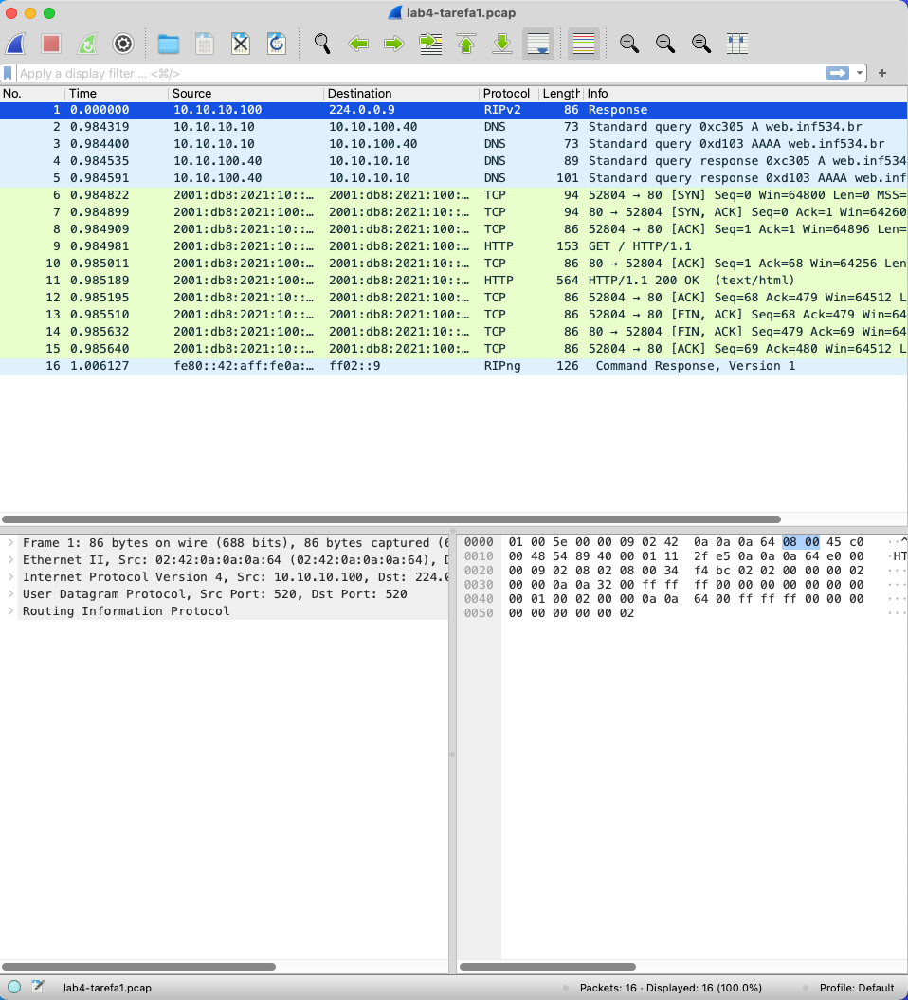
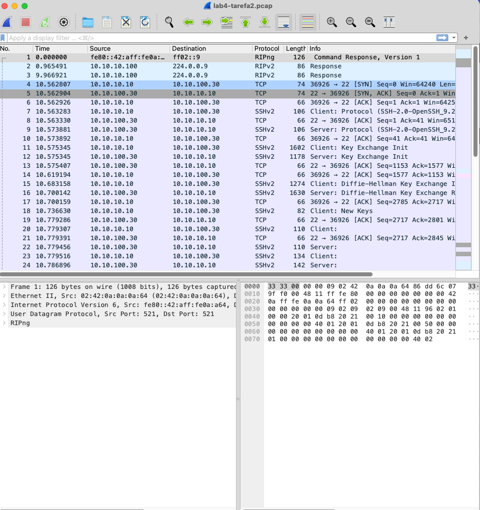
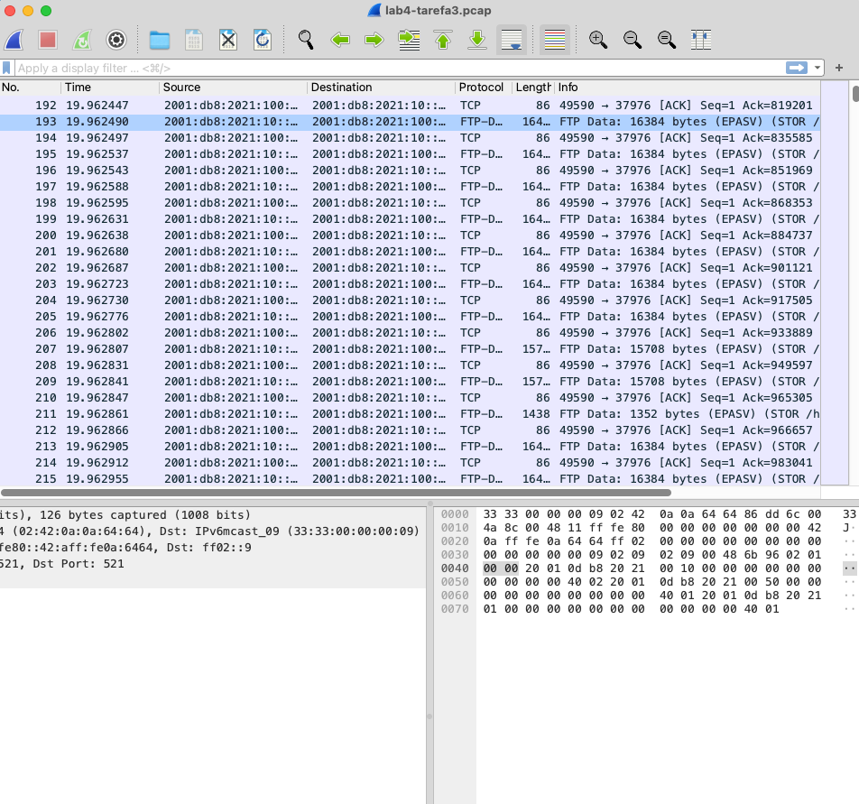

# Laboratório 4: TCP

**Aluno**: Guilherme Rodriguez Vicentin

**E-mail**: vicentingr@gmail.com

## Tarefa 1

Através do cliente 1, iremos monitorar uma conexão web com o servidor.

```bash
$ docker exec -it client1 bash

root@cliente1:/# tcpdump -i eth0 -n -s 0 -w /home/lab4-tarefa1.pcap &
root@cliente1:/# curl http://web
<html>
    <head>
        <title>
            Bem-vindos a inf534
        </title>
    </head>

    <body>
        <h1>Bem-vindos a inf534</h1>
        <p>
            Pagina exemplo para a disciplina inf534
        </p>
    </body>
</html>
```

Analisando o cabeçalho TCP no programa Wireshark:

Pacote 1:

```
Transmission Control Protocol, Src Port: 52804, Dst Port: 80, Seq: 0, Len: 0
    Source Port: 52804
    Destination Port: 80
    [Stream index: 0]
    [Conversation completeness: Complete, WITH_DATA (31)]
    [TCP Segment Len: 0]
    Sequence Number: 0    (relative sequence number)
    Sequence Number (raw): 1276234900
    [Next Sequence Number: 1    (relative sequence number)]
    Acknowledgment Number: 0
    Acknowledgment number (raw): 0
    1010 .... = Header Length: 40 bytes (10)
    Flags: 0x002 (SYN)
    Window: 64800
    [Calculated window size: 64800]
    Checksum: 0x9d12 [unverified]
    [Checksum Status: Unverified]
    Urgent Pointer: 0
    Options: (20 bytes), Maximum segment size, SACK permitted, Timestamps, No-Operation (NOP), Window scale
    [Timestamps]
```

a. **Flags utilizadas**: SYN (Synchronize Sequence Numbers), que é utilizada para iniciar uma conexão TCP.
b. **Opções utilizadas**: Maximum segment size, SACK permitted, Timestamps, No-Operation (NOP), Window scale.
c. **Portas de origem e destino**: Porta de origem 52804 e porta de destino 80.
d. **Número de sequência**: 0.
e. **Tamanho da janela**: 64800.

Pacote 2:

```
Transmission Control Protocol, Src Port: 80, Dst Port: 52804, Seq: 0, Ack: 1, Len: 0
    Source Port: 80
    Destination Port: 52804
    [Stream index: 0]
    [Conversation completeness: Complete, WITH_DATA (31)]
    [TCP Segment Len: 0]
    Sequence Number: 0    (relative sequence number)
    Sequence Number (raw): 1389335839
    [Next Sequence Number: 1    (relative sequence number)]
    Acknowledgment Number: 1    (relative ack number)
    Acknowledgment number (raw): 1276234901
    1010 .... = Header Length: 40 bytes (10)
    Flags: 0x012 (SYN, ACK)
    Window: 64260
    [Calculated window size: 64260]
    Checksum: 0x9d12 [unverified]
    [Checksum Status: Unverified]
    Urgent Pointer: 0
    Options: (20 bytes), Maximum segment size, SACK permitted, Timestamps, No-Operation (NOP), Window scale
    [Timestamps]
    [SEQ/ACK analysis]
```

a. **Flags utilizadas**: SYN (Synchronize Sequence Numbers) e ACK (Acknowledgment).
b. **Opções utilizadas**: Maximum segment size, SACK permitted, Timestamps, No-Operation (NOP), Window scale.
c. **Portas de origem e destino**: Porta de origem 80 e porta de destino 52804.
d. **Número de sequência**: 0.
e. **Tamanho da janela**: 64260.

Pacote 3:

```
Transmission Control Protocol, Src Port: 52804, Dst Port: 80, Seq: 1, Ack: 1, Len: 0
    Source Port: 52804
    Destination Port: 80
    [Stream index: 0]
    [Conversation completeness: Complete, WITH_DATA (31)]
    [TCP Segment Len: 0]
    Sequence Number: 1    (relative sequence number)
    Sequence Number (raw): 1276234901
    [Next Sequence Number: 1    (relative sequence number)]
    Acknowledgment Number: 1    (relative ack number)
    Acknowledgment number (raw): 1389335840
    1000 .... = Header Length: 32 bytes (8)
    Flags: 0x010 (ACK)
    Window: 507
    [Calculated window size: 64896]
    [Window size scaling factor: 128]
    Checksum: 0x9d0a [unverified]
    [Checksum Status: Unverified]
    Urgent Pointer: 0
    Options: (12 bytes), No-Operation (NOP), No-Operation (NOP), Timestamps
    [Timestamps]
    [SEQ/ACK analysis]
```

a. **Flags utilizadas**: ACK (Acknowledgment).
b. **Opções utilizadas**: No-Operation (NOP), No-Operation (NOP), Timestamps.
c. **Portas de origem e destino**: Porta de origem 52804 e porta de destino 80.
d. **Número de sequência**: 1.
e. **Tamanho da janela**: 64896.



## Tarefa 2

Iremos observar os pacotes trocados entre o cliente 1 e client 2 utilizando scp.

```bash
$ docker exec -it client1 bash

root@cliente1:/# tcpdump -i eth0 -n -s 0 -w /home/lab4-tarefa2.pcap &
root@cliente1:/# echo "Hello" > /home/hello.txt
root@cliente1:/# scp /home/hello.txt inf500@10.10.100.30:/home # senha: inf500
```



Ao analisar o resultado obtido, podemos identificas os 3 primeiros pacotes como a negociação de conexão entre o cliente e o servidor. O primeiro pacote é o SYN enviado pelo cliente, o segundo é o SYN-ACK enviado pelo servidor e o terceiro é o ACK enviado pelo cliente. Após a negociação, o cliente envia o arquivo hello.txt para o servidor.
Após os pacotes TCP, podemos observar os pacotes SSH, que são utilizados para a transferência do arquivo. Entre um pacote e outro, podemos observar o envio de um pacote ACK, que é utilizado para confirmar a recepção do pacote anterior.
Por fim, podemos observar 4 pacotes TCP, que são utilizados para finalizar a conexão entre o cliente e o servidor, utilizando a flag FIN.

## Tarefa 3

Ativaremos a monitoração de pacotes no servidos ftp e realizaremos a transferência de um arquivo do cliente 1 para o servidor ftp.

```bash
$ docker exec -it ftp bash

root@ftp:/# tcpdump -i eth0 -n -s 0 -w /home/lab4-tarefa3.pcap &
root@ftp:/# exit

$ docker exec -it cliente1 bash

root@cliente1:/# dd if=/dev/zero of=/home/200MB.txt bs=1M count=200
root@cliente1:/# ftp inf500@ftp # senha: inf500
ftp> put /home/200MB.txt
150 Opening BINARY mode data connection for /home/200MB.txt
100% |************************************************************************|   200 MiB  313.28 MiB/s    00:00 ETA
226 Transfer complete
209715200 bytes sent in 00:01 (188.55 MiB/s)
```

O processo durou aproximadamente 1 segundo, e o arquivo foi transferido com uma taxa de transferência de 188.55 MiB/s.



## Tarefa 4 e 5

Repetiremos a tarefa 3, porem iremos configurar o cliente 1 da seguinte forma:

```bash
$ docker exec -it cliente1 bash

root@cliente1:/# tc qdisc add dev eth0 root netem delay 100000
```

O comando acima adiciona um atraso de 100ms na interface eth0 do cliente 1.

Observando a transferência do arquivo 200MB.txt para o servidor ftp:

```bash
root@cliente1:/# ftp inf500@ftp # senha: inf500
ftp> put /home/200MB.txt
100% |************************************************************************|   200 MiB   14.81 MiB/s    00:00 ETA
226 Transfer complete
209715200 bytes sent in 00:14 (14.26 MiB/s)
```

Levará aproximadamente 14 segundos para transferir o arquivo 200MB.txt para o servidor ftp. A taxa de transferência foi de 14.26 MiB/s.

## Tarefa 6 e 7

Iremos configurar novamente o cliente 1, adicionando um atraso de 680ms e um jitter de 50ms.

```bash
$ docker exec -it cliente1 bash

root@cliente1:/# tc qdisc replace dev eth0 root netem delay 680000 50000
```

Enviando novamente o arquivo de 200MB, obtive o seguinte resultado:

```bash
root@cliente1:/# ftp inf500@ftp # senha: inf500
ftp> put /home/200MB.txt
150 Opening BINARY mode data connection for /home/200MB.txt
100% |************************************************************************|   200 MiB    1.84 MiB/s    00:00 ETA
226 Transfer complete
209715200 bytes sent in 01:49 (1.82 MiB/s)
```

Levará aproximadamente 1 minuto e 49 segundos para transferir o arquivo 200MB.txt para o servidor ftp. A taxa de transferência foi de 1.82 MiB/s.

## Tarefa 8

Vamos agora configurar o cliente 1 da seguinte forma. Removendo o atraso e o jitter e adicionando 10% de perda de pacotes.

```bash
$ docker exec -it cliente1 bash

root@cliente1:/# tc qdisc delete dev eth0 root netem delay 680000 50000
root@cliente1:/# tc qdisc add dev eth0 root netem loss 10%
```

## Tarefa 9

Para testar o impacto da perda de pacotes, iremos executar uma rajada de ping e observar a perda de pacotes.

```bash
$ docker exec -it cliente1 bash

root@cliente1:/# ping -c 100 -i 0 ftp
PING ftp(ftp.inf534.br (2001:db8:2021:100::20)) 56 data bytes
64 bytes from ftp.inf534.br (2001:db8:2021:100::20): icmp_seq=1 ttl=62 time=0.074 ms
64 bytes from ftp.inf534.br (2001:db8:2021:100::20): icmp_seq=2 ttl=62 time=0.050 ms
64 bytes from ftp.inf534.br (2001:db8:2021:100::20): icmp_seq=3 ttl=62 time=0.062 ms
64 bytes from ftp.inf534.br (2001:db8:2021:100::20): icmp_seq=4 ttl=62 time=0.043 ms
64 bytes from ftp.inf534.br (2001:db8:2021:100::20): icmp_seq=5 ttl=62 time=0.042 ms
64 bytes from ftp.inf534.br (2001:db8:2021:100::20): icmp_seq=6 ttl=62 time=0.041 ms
64 bytes from ftp.inf534.br (2001:db8:2021:100::20): icmp_seq=7 ttl=62 time=0.037 ms
64 bytes from ftp.inf534.br (2001:db8:2021:100::20): icmp_seq=8 ttl=62 time=0.037 ms
64 bytes from ftp.inf534.br (2001:db8:2021:100::20): icmp_seq=9 ttl=62 time=0.036 ms
64 bytes from ftp.inf534.br (2001:db8:2021:100::20): icmp_seq=10 ttl=62 time=0.036 ms
64 bytes from ftp.inf534.br (2001:db8:2021:100::20): icmp_seq=11 ttl=62 time=0.036 ms
64 bytes from ftp.inf534.br (2001:db8:2021:100::20): icmp_seq=13 ttl=62 time=0.084 ms
64 bytes from ftp.inf534.br (2001:db8:2021:100::20): icmp_seq=14 ttl=62 time=0.040 ms
64 bytes from ftp.inf534.br (2001:db8:2021:100::20): icmp_seq=15 ttl=62 time=0.035 ms
64 bytes from ftp.inf534.br (2001:db8:2021:100::20): icmp_seq=17 ttl=62 time=0.060 ms
64 bytes from ftp.inf534.br (2001:db8:2021:100::20): icmp_seq=18 ttl=62 time=0.043 ms
64 bytes from ftp.inf534.br (2001:db8:2021:100::20): icmp_seq=19 ttl=62 time=0.088 ms
64 bytes from ftp.inf534.br (2001:db8:2021:100::20): icmp_seq=20 ttl=62 time=0.051 ms
64 bytes from ftp.inf534.br (2001:db8:2021:100::20): icmp_seq=21 ttl=62 time=0.042 ms
64 bytes from 2001:db8:2021:100::20: icmp_seq=22 ttl=62 time=0.043 ms
64 bytes from ftp.inf534.br (2001:db8:2021:100::20): icmp_seq=24 ttl=62 time=0.100 ms
64 bytes from ftp.inf534.br (2001:db8:2021:100::20): icmp_seq=25 ttl=62 time=0.058 ms
64 bytes from ftp.inf534.br (2001:db8:2021:100::20): icmp_seq=26 ttl=62 time=0.041 ms
64 bytes from ftp.inf534.br (2001:db8:2021:100::20): icmp_seq=27 ttl=62 time=0.038 ms
64 bytes from ftp.inf534.br (2001:db8:2021:100::20): icmp_seq=28 ttl=62 time=0.037 ms
64 bytes from ftp.inf534.br (2001:db8:2021:100::20): icmp_seq=29 ttl=62 time=0.061 ms
64 bytes from ftp.inf534.br (2001:db8:2021:100::20): icmp_seq=30 ttl=62 time=0.049 ms
64 bytes from ftp.inf534.br (2001:db8:2021:100::20): icmp_seq=31 ttl=62 time=0.039 ms
64 bytes from ftp.inf534.br (2001:db8:2021:100::20): icmp_seq=32 ttl=62 time=0.071 ms
64 bytes from ftp.inf534.br (2001:db8:2021:100::20): icmp_seq=33 ttl=62 time=0.037 ms
64 bytes from ftp.inf534.br (2001:db8:2021:100::20): icmp_seq=34 ttl=62 time=0.036 ms
64 bytes from ftp.inf534.br (2001:db8:2021:100::20): icmp_seq=36 ttl=62 time=0.107 ms
64 bytes from ftp.inf534.br (2001:db8:2021:100::20): icmp_seq=37 ttl=62 time=0.050 ms
64 bytes from ftp.inf534.br (2001:db8:2021:100::20): icmp_seq=38 ttl=62 time=0.040 ms
64 bytes from ftp.inf534.br (2001:db8:2021:100::20): icmp_seq=39 ttl=62 time=0.038 ms
64 bytes from ftp.inf534.br (2001:db8:2021:100::20): icmp_seq=40 ttl=62 time=0.037 ms
64 bytes from 2001:db8:2021:100::20: icmp_seq=41 ttl=62 time=0.037 ms
64 bytes from ftp.inf534.br (2001:db8:2021:100::20): icmp_seq=42 ttl=62 time=0.060 ms
64 bytes from ftp.inf534.br (2001:db8:2021:100::20): icmp_seq=44 ttl=62 time=0.097 ms
64 bytes from ftp.inf534.br (2001:db8:2021:100::20): icmp_seq=45 ttl=62 time=0.056 ms
64 bytes from ftp.inf534.br (2001:db8:2021:100::20): icmp_seq=47 ttl=62 time=0.078 ms
64 bytes from ftp.inf534.br (2001:db8:2021:100::20): icmp_seq=48 ttl=62 time=0.045 ms
64 bytes from ftp.inf534.br (2001:db8:2021:100::20): icmp_seq=49 ttl=62 time=0.038 ms
64 bytes from ftp.inf534.br (2001:db8:2021:100::20): icmp_seq=50 ttl=62 time=0.037 ms
64 bytes from ftp.inf534.br (2001:db8:2021:100::20): icmp_seq=51 ttl=62 time=0.079 ms
64 bytes from ftp.inf534.br (2001:db8:2021:100::20): icmp_seq=52 ttl=62 time=0.064 ms
64 bytes from ftp.inf534.br (2001:db8:2021:100::20): icmp_seq=53 ttl=62 time=0.042 ms
64 bytes from ftp.inf534.br (2001:db8:2021:100::20): icmp_seq=54 ttl=62 time=0.037 ms
64 bytes from ftp.inf534.br (2001:db8:2021:100::20): icmp_seq=55 ttl=62 time=0.038 ms
64 bytes from ftp.inf534.br (2001:db8:2021:100::20): icmp_seq=56 ttl=62 time=0.036 ms
64 bytes from ftp.inf534.br (2001:db8:2021:100::20): icmp_seq=57 ttl=62 time=0.036 ms
64 bytes from ftp.inf534.br (2001:db8:2021:100::20): icmp_seq=58 ttl=62 time=0.035 ms
64 bytes from ftp.inf534.br (2001:db8:2021:100::20): icmp_seq=59 ttl=62 time=0.071 ms
64 bytes from ftp.inf534.br (2001:db8:2021:100::20): icmp_seq=61 ttl=62 time=0.098 ms
64 bytes from ftp.inf534.br (2001:db8:2021:100::20): icmp_seq=62 ttl=62 time=0.054 ms
64 bytes from ftp.inf534.br (2001:db8:2021:100::20): icmp_seq=63 ttl=62 time=0.039 ms
64 bytes from ftp.inf534.br (2001:db8:2021:100::20): icmp_seq=64 ttl=62 time=0.037 ms
64 bytes from ftp.inf534.br (2001:db8:2021:100::20): icmp_seq=65 ttl=62 time=0.035 ms
64 bytes from ftp.inf534.br (2001:db8:2021:100::20): icmp_seq=66 ttl=62 time=0.077 ms
64 bytes from ftp.inf534.br (2001:db8:2021:100::20): icmp_seq=67 ttl=62 time=0.047 ms
64 bytes from ftp.inf534.br (2001:db8:2021:100::20): icmp_seq=68 ttl=62 time=0.039 ms
64 bytes from ftp.inf534.br (2001:db8:2021:100::20): icmp_seq=69 ttl=62 time=0.052 ms
64 bytes from ftp.inf534.br (2001:db8:2021:100::20): icmp_seq=70 ttl=62 time=0.038 ms
64 bytes from ftp.inf534.br (2001:db8:2021:100::20): icmp_seq=71 ttl=62 time=0.037 ms
64 bytes from ftp.inf534.br (2001:db8:2021:100::20): icmp_seq=72 ttl=62 time=0.036 ms
64 bytes from ftp.inf534.br (2001:db8:2021:100::20): icmp_seq=74 ttl=62 time=0.085 ms
64 bytes from ftp.inf534.br (2001:db8:2021:100::20): icmp_seq=75 ttl=62 time=0.050 ms
64 bytes from ftp.inf534.br (2001:db8:2021:100::20): icmp_seq=76 ttl=62 time=0.033 ms
64 bytes from ftp.inf534.br (2001:db8:2021:100::20): icmp_seq=77 ttl=62 time=0.032 ms
64 bytes from ftp.inf534.br (2001:db8:2021:100::20): icmp_seq=78 ttl=62 time=0.032 ms
64 bytes from ftp.inf534.br (2001:db8:2021:100::20): icmp_seq=79 ttl=62 time=0.031 ms
64 bytes from ftp.inf534.br (2001:db8:2021:100::20): icmp_seq=80 ttl=62 time=0.031 ms
64 bytes from ftp.inf534.br (2001:db8:2021:100::20): icmp_seq=81 ttl=62 time=0.032 ms
64 bytes from ftp.inf534.br (2001:db8:2021:100::20): icmp_seq=82 ttl=62 time=0.032 ms
64 bytes from ftp.inf534.br (2001:db8:2021:100::20): icmp_seq=83 ttl=62 time=0.031 ms
64 bytes from ftp.inf534.br (2001:db8:2021:100::20): icmp_seq=85 ttl=62 time=0.065 ms
64 bytes from ftp.inf534.br (2001:db8:2021:100::20): icmp_seq=86 ttl=62 time=0.045 ms
64 bytes from ftp.inf534.br (2001:db8:2021:100::20): icmp_seq=87 ttl=62 time=0.037 ms
64 bytes from ftp.inf534.br (2001:db8:2021:100::20): icmp_seq=88 ttl=62 time=0.036 ms
64 bytes from ftp.inf534.br (2001:db8:2021:100::20): icmp_seq=89 ttl=62 time=0.035 ms
64 bytes from ftp.inf534.br (2001:db8:2021:100::20): icmp_seq=90 ttl=62 time=0.036 ms
64 bytes from ftp.inf534.br (2001:db8:2021:100::20): icmp_seq=91 ttl=62 time=0.036 ms
64 bytes from ftp.inf534.br (2001:db8:2021:100::20): icmp_seq=92 ttl=62 time=0.035 ms
64 bytes from ftp.inf534.br (2001:db8:2021:100::20): icmp_seq=93 ttl=62 time=0.035 ms
64 bytes from ftp.inf534.br (2001:db8:2021:100::20): icmp_seq=94 ttl=62 time=0.035 ms
64 bytes from ftp.inf534.br (2001:db8:2021:100::20): icmp_seq=95 ttl=62 time=0.035 ms
64 bytes from ftp.inf534.br (2001:db8:2021:100::20): icmp_seq=96 ttl=62 time=0.034 ms
64 bytes from ftp.inf534.br (2001:db8:2021:100::20): icmp_seq=97 ttl=62 time=0.035 ms
64 bytes from ftp.inf534.br (2001:db8:2021:100::20): icmp_seq=99 ttl=62 time=0.057 ms
64 bytes from 2001:db8:2021:100::20: icmp_seq=100 ttl=62 time=0.070 ms

--- ftp ping statistics ---
100 packets transmitted, 90 received, 10% packet loss, time 60232ms
rtt min/avg/max/mdev = 0.031/0.047/0.107/0.018 ms, ipg/ewma 608.405/0.043 ms
```

Como podemos observar, 10% dos pacotes foram perdidos durante a transmissão. O tempo médio de ida e volta foi de 0.047 ms.

## Tarefa 10 e 11

Vamos reconfigurar o cliente 1, removendo a perda de pacotes e adicionando corrupção de 10%.

```bash
$ docker exec -it cliente1 bash

root@cliente1:/# tc qdisc delete dev eth0 root netem loss 10%
root@cliente1:/# tc qdisc add dev eth0 root netem corrupt 10%
```

Iremos realizar novamente o teste de ping e analisar o resultado.

```bash
$ docker exec -it cliente1 bash

root@cliente1:/# ping -c 100 -i 0 ftp
PING ftp(ftp.inf534.br (2001:db8:2021:100::20)) 56 data bytes
64 bytes from ftp.inf534.br (2001:db8:2021:100::20): icmp_seq=1 ttl=62 time=0.093 ms
64 bytes from ftp.inf534.br (2001:db8:2021:100::20): icmp_seq=2 ttl=62 time=0.059 ms
64 bytes from ftp.inf534.br (2001:db8:2021:100::20): icmp_seq=4 ttl=62 time=0.057 ms
64 bytes from ftp.inf534.br (2001:db8:2021:100::20): icmp_seq=5 ttl=62 time=0.041 ms
64 bytes from ftp.inf534.br (2001:db8:2021:100::20): icmp_seq=6 ttl=62 time=0.063 ms
64 bytes from ftp.inf534.br (2001:db8:2021:100::20): icmp_seq=7 ttl=62 time=0.048 ms
64 bytes from ftp.inf534.br (2001:db8:2021:100::20): icmp_seq=8 ttl=62 time=0.039 ms
64 bytes from ftp.inf534.br (2001:db8:2021:100::20): icmp_seq=9 ttl=62 time=0.062 ms
64 bytes from ftp.inf534.br (2001:db8:2021:100::20): icmp_seq=10 ttl=62 time=0.042 ms
64 bytes from ftp.inf534.br (2001:db8:2021:100::20): icmp_seq=11 ttl=62 time=0.037 ms
64 bytes from ftp.inf534.br (2001:db8:2021:100::20): icmp_seq=12 ttl=62 time=0.034 ms
64 bytes from ftp.inf534.br (2001:db8:2021:100::20): icmp_seq=13 ttl=62 time=0.033 ms
64 bytes from ftp.inf534.br (2001:db8:2021:100::20): icmp_seq=14 ttl=62 time=0.032 ms
64 bytes from ftp.inf534.br (2001:db8:2021:100::20): icmp_seq=15 ttl=62 time=0.033 ms
64 bytes from ftp.inf534.br (2001:db8:2021:100::20): icmp_seq=16 ttl=62 time=0.032 ms
64 bytes from ftp.inf534.br (2001:db8:2021:100::20): icmp_seq=17 ttl=62 time=0.064 ms
64 bytes from ftp.inf534.br (2001:db8:2021:100::20): icmp_seq=18 ttl=62 time=0.073 ms
64 bytes from ftp.inf534.br (2001:db8:2021:100::20): icmp_seq=19 ttl=62 time=0.049 ms
64 bytes from ftp.inf534.br (2001:db8:2021:100::20): icmp_seq=20 ttl=62 time=0.039 ms
64 bytes from ftp.inf534.br (2001:db8:2021:100::20): icmp_seq=21 ttl=62 time=0.037 ms
64 bytes from ftp.inf534.br (2001:db8:2021:100::20): icmp_seq=22 ttl=62 time=0.061 ms
64 bytes from ftp.inf534.br (2001:db8:2021:100::20): icmp_seq=23 ttl=62 time=0.108 ms
64 bytes from ftp.inf534.br (2001:db8:2021:100::20): icmp_seq=24 ttl=62 time=0.048 ms
64 bytes from ftp.inf534.br (2001:db8:2021:100::20): icmp_seq=25 ttl=62 time=0.039 ms
64 bytes from ftp.inf534.br (2001:db8:2021:100::20): icmp_seq=26 ttl=62 time=0.038 ms
64 bytes from ftp.inf534.br (2001:db8:2021:100::20): icmp_seq=27 ttl=62 time=0.036 ms
64 bytes from ftp.inf534.br (2001:db8:2021:100::20): icmp_seq=28 ttl=62 time=0.050 ms
64 bytes from ftp.inf534.br (2001:db8:2021:100::20): icmp_seq=29 ttl=62 time=0.036 ms
64 bytes from ftp.inf534.br (2001:db8:2021:100::20): icmp_seq=30 ttl=62 time=0.036 ms
64 bytes from ftp.inf534.br (2001:db8:2021:100::20): icmp_seq=31 ttl=62 time=0.036 ms
64 bytes from ftp.inf534.br (2001:db8:2021:100::20): icmp_seq=32 ttl=62 time=0.035 ms
64 bytes from ftp.inf534.br (2001:db8:2021:100::20): icmp_seq=33 ttl=62 time=0.036 ms
64 bytes from ftp.inf534.br (2001:db8:2021:100::20): icmp_seq=34 ttl=62 time=0.036 ms
64 bytes from ftp.inf534.br (2001:db8:2021:100::20): icmp_seq=35 ttl=62 time=0.035 ms
64 bytes from ftp.inf534.br (2001:db8:2021:100::20): icmp_seq=36 ttl=62 time=0.035 ms
64 bytes from ftp.inf534.br (2001:db8:2021:100::20): icmp_seq=37 ttl=62 time=0.036 ms
64 bytes from ftp.inf534.br (2001:db8:2021:100::20): icmp_seq=38 ttl=62 time=0.036 ms
64 bytes from ftp.inf534.br (2001:db8:2021:100::20): icmp_seq=39 ttl=62 time=0.050 ms
64 bytes from ftp.inf534.br (2001:db8:2021:100::20): icmp_seq=40 ttl=62 time=0.036 ms
64 bytes from ftp.inf534.br (2001:db8:2021:100::20): icmp_seq=41 ttl=62 time=0.035 ms
64 bytes from ftp.inf534.br (2001:db8:2021:100::20): icmp_seq=42 ttl=62 time=0.034 ms
64 bytes from ftp.inf534.br (2001:db8:2021:100::20): icmp_seq=43 ttl=62 time=0.035 ms
64 bytes from ftp.inf534.br (2001:db8:2021:100::20): icmp_seq=44 ttl=62 time=0.078 ms
64 bytes from ftp.inf534.br (2001:db8:2021:100::20): icmp_seq=45 ttl=62 time=0.048 ms
64 bytes from ftp.inf534.br (2001:db8:2021:100::20): icmp_seq=46 ttl=62 time=0.044 ms
64 bytes from ftp.inf534.br (2001:db8:2021:100::20): icmp_seq=47 ttl=62 time=0.037 ms
64 bytes from ftp.inf534.br (2001:db8:2021:100::20): icmp_seq=48 ttl=62 time=0.037 ms
64 bytes from ftp.inf534.br (2001:db8:2021:100::20): icmp_seq=49 ttl=62 time=0.037 ms
64 bytes from ftp.inf534.br (2001:db8:2021:100::20): icmp_seq=51 ttl=62 time=0.099 ms
64 bytes from ftp.inf534.br (2001:db8:2021:100::20): icmp_seq=52 ttl=62 time=0.044 ms
64 bytes from ftp.inf534.br (2001:db8:2021:100::20): icmp_seq=53 ttl=62 time=0.042 ms
64 bytes from ftp.inf534.br (2001:db8:2021:100::20): icmp_seq=54 ttl=62 time=0.038 ms
64 bytes from ftp.inf534.br (2001:db8:2021:100::20): icmp_seq=55 ttl=62 time=0.058 ms
64 bytes from ftp.inf534.br (2001:db8:2021:100::20): icmp_seq=56 ttl=62 time=0.045 ms
64 bytes from ftp.inf534.br (2001:db8:2021:100::20): icmp_seq=58 ttl=62 time=0.130 ms
64 bytes from ftp.inf534.br (2001:db8:2021:100::20): icmp_seq=59 ttl=62 time=0.038 ms
64 bytes from ftp.inf534.br (2001:db8:2021:100::20): icmp_seq=60 ttl=62 time=0.046 ms
64 bytes from ftp.inf534.br (2001:db8:2021:100::20): icmp_seq=61 ttl=62 time=0.033 ms
64 bytes from ftp.inf534.br (2001:db8:2021:100::20): icmp_seq=63 ttl=62 time=0.054 ms
64 bytes from ftp.inf534.br (2001:db8:2021:100::20): icmp_seq=64 ttl=62 time=0.035 ms
64 bytes from ftp.inf534.br (2001:db8:2021:100::20): icmp_seq=65 ttl=62 time=0.032 ms
64 bytes from ftp.inf534.br (2001:db8:2021:100::20): icmp_seq=66 ttl=62 time=0.032 ms
64 bytes from ftp.inf534.br (2001:db8:2021:100::20): icmp_seq=67 ttl=62 time=0.033 ms
64 bytes from ftp.inf534.br (2001:db8:2021:100::20): icmp_seq=68 ttl=62 time=0.031 ms
64 bytes from ftp.inf534.br (2001:db8:2021:100::20): icmp_seq=69 ttl=62 time=0.031 ms
64 bytes from ftp.inf534.br (2001:db8:2021:100::20): icmp_seq=70 ttl=62 time=0.031 ms
64 bytes from 2001:db8:2021:100::20: icmp_seq=71 ttl=62 time=0.031 ms
64 bytes from ftp.inf534.br (2001:db8:2021:100::20): icmp_seq=72 ttl=62 time=0.036 ms
64 bytes from ftp.inf534.br (2001:db8:2021:100::20): icmp_seq=74 ttl=62 time=0.097 ms
64 bytes from ftp.inf534.br (2001:db8:2021:100::20): icmp_seq=75 ttl=62 time=0.054 ms
64 bytes from ftp.inf534.br (2001:db8:2021:100::20): icmp_seq=78 ttl=62 time=0.094 ms
64 bytes from ftp.inf534.br (2001:db8:2021:100::20): icmp_seq=79 ttl=62 time=0.048 ms
64 bytes from ftp.inf534.br (2001:db8:2021:100::20): icmp_seq=80 ttl=62 time=0.042 ms
64 bytes from ftp.inf534.br (2001:db8:2021:100::20): icmp_seq=81 ttl=62 time=0.038 ms
64 bytes from ftp.inf534.br (2001:db8:2021:100::20): icmp_seq=82 ttl=62 time=0.037 ms
64 bytes from ftp.inf534.br (2001:db8:2021:100::20): icmp_seq=83 ttl=62 time=0.037 ms
64 bytes from ftp.inf534.br (2001:db8:2021:100::20): icmp_seq=84 ttl=62 time=0.036 ms
64 bytes from ftp.inf534.br (2001:db8:2021:100::20): icmp_seq=85 ttl=62 time=0.036 ms
64 bytes from ftp.inf534.br (2001:db8:2021:100::20): icmp_seq=86 ttl=62 time=0.036 ms
64 bytes from ftp.inf534.br (2001:db8:2021:100::20): icmp_seq=87 ttl=62 time=0.036 ms
64 bytes from ftp.inf534.br (2001:db8:2021:100::20): icmp_seq=88 ttl=62 time=0.036 ms
64 bytes from ftp.inf534.br (2001:db8:2021:100::20): icmp_seq=89 ttl=62 time=0.035 ms
64 bytes from ftp.inf534.br (2001:db8:2021:100::20): icmp_seq=90 ttl=62 time=0.036 ms
64 bytes from ftp.inf534.br (2001:db8:2021:100::20): icmp_seq=91 ttl=62 time=0.035 ms
64 bytes from ftp.inf534.br (2001:db8:2021:100::20): icmp_seq=92 ttl=62 time=0.035 ms
64 bytes from ftp.inf534.br (2001:db8:2021:100::20): icmp_seq=93 ttl=62 time=0.035 ms
64 bytes from ftp.inf534.br (2001:db8:2021:100::20): icmp_seq=94 ttl=62 time=0.036 ms
64 bytes from ftp.inf534.br (2001:db8:2021:100::20): icmp_seq=95 ttl=62 time=0.035 ms
64 bytes from ftp.inf534.br (2001:db8:2021:100::20): icmp_seq=96 ttl=62 time=0.035 ms
64 bytes from ftp.inf534.br (2001:db8:2021:100::20): icmp_seq=97 ttl=62 time=0.035 ms
64 bytes from ftp.inf534.br (2001:db8:2021:100::20): icmp_seq=98 ttl=62 time=0.035 ms
64 bytes from ftp.inf534.br (2001:db8:2021:100::20): icmp_seq=99 ttl=62 time=0.035 ms
64 bytes from ftp.inf534.br (2001:db8:2021:100::20): icmp_seq=100 ttl=62 time=0.035 ms

--- ftp ping statistics ---
100 packets transmitted, 93 received, 7% packet loss, time 55186ms
rtt min/avg/max/mdev = 0.031/0.044/0.130/0.018 ms, ipg/ewma 557.438/0.036 ms
```

Obtivemos 7% de perda de pacotes durante a transmissão. O tempo médio de ida e volta foi de 0.044 ms.
