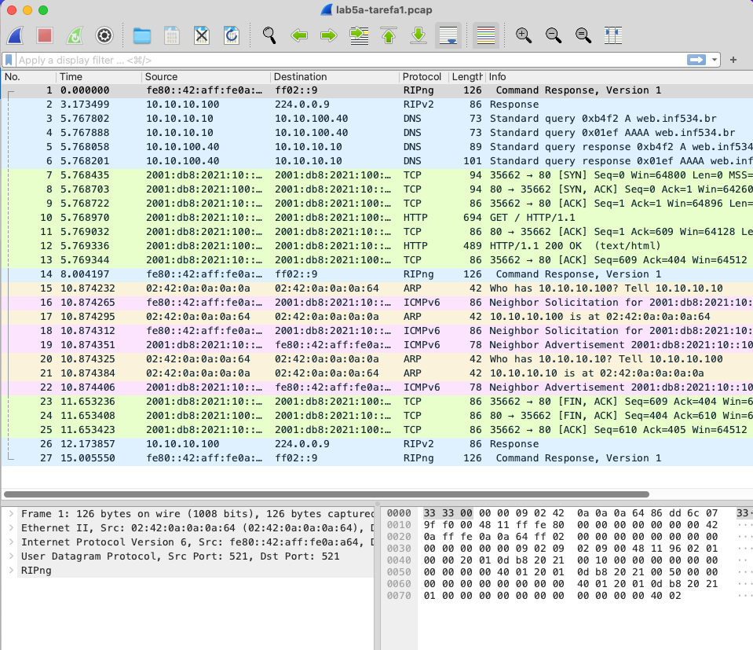

# Lab 5a: UDP e DNS

**Aluno**: Guilherme Rodriguez Vicentin

**E-mail**: vicentingr@gmail.com

## 1 - Análise dos protocolos TCP/UDP/DNS

Neste primeiro exercício, iremos monitorar os pacotes enviados do cliente 1 para o servidor web. Para isso,
utilizaremos o nome de domínio `web.inf634.br` ao invés do endereço de IP diretamente. Desta forma, conseguiremos
observar o processo de resolução de nomes de domínio também.

```bash
$ docker exec -it cliente1 bash

root@cliente1:/# tcpdump -i eth0 -n -s 0 -w /home/lab5a-tarefa1.pcap &
root@cliente1:/# links http://web.inf534.br
root@cliente1:/# killall tcpdump
```

Agora, vamos analisar o arquivo `lab5a-tarefa1.pcap` no Wireshark.



### 1.1 - Análise do pacote DNS

```
User Datagram Protocol, Src Port: 59328, Dst Port: 53
    Source Port: 59328
    Destination Port: 53
    Length: 39
    Checksum: 0x827e [unverified]
    [Checksum Status: Unverified]
    [Stream index: 2]
    [Timestamps]
    UDP payload (31 bytes)

User Datagram Protocol, Src Port: 53, Dst Port: 59328
    Source Port: 53
    Destination Port: 59328
    Length: 55
    Checksum: 0x828e [unverified]
    [Checksum Status: Unverified]
    [Stream index: 2]
    [Timestamps]
    UDP payload (47 bytes)
```

Podemos observar que o cliente enviou uma requisição DNS para o servidor DNS (porta 53) utilizando o protocolo UDP na camada de transporte e recebeu uma resposta.

### 1.2 - Análise do pacote TCP

Abaixo podemos acompanhar o handshake TCP entre o cliente e o servidor web.
Podemos ver o envio do SYN por parte do cliente e a resposta SYN/ACK do servidor. Por fim, o cliente envia o ACK para finalizar o handshake.
A comunicação é realizada entre as portas 35662 (cliente) e 80 (servidor).

```
Transmission Control Protocol, Src Port: 35662, Dst Port: 80, Seq: 0, Len: 0
    Source Port: 35662
    Destination Port: 80
    [Stream index: 0]
    [Conversation completeness: Complete, WITH_DATA (31)]
    [TCP Segment Len: 0]
    Sequence Number: 0    (relative sequence number)
    Sequence Number (raw): 2959018940
    [Next Sequence Number: 1    (relative sequence number)]
    Acknowledgment Number: 0
    Acknowledgment number (raw): 0
    1010 .... = Header Length: 40 bytes (10)
    Flags: 0x002 (SYN)
    Window: 64800
    [Calculated window size: 64800]
    Checksum: 0x9d12 [unverified]
    [Checksum Status: Unverified]
    Urgent Pointer: 0
    Options: (20 bytes), Maximum segment size, SACK permitted, Timestamps, No-Operation (NOP), Window scale
    [Timestamps]

Transmission Control Protocol, Src Port: 80, Dst Port: 35662, Seq: 0, Ack: 1, Len: 0
    Source Port: 80
    Destination Port: 35662
    [Stream index: 0]
    [Conversation completeness: Complete, WITH_DATA (31)]
    [TCP Segment Len: 0]
    Sequence Number: 0    (relative sequence number)
    Sequence Number (raw): 2072583494
    [Next Sequence Number: 1    (relative sequence number)]
    Acknowledgment Number: 1    (relative ack number)
    Acknowledgment number (raw): 2959018941
    1010 .... = Header Length: 40 bytes (10)
    Flags: 0x012 (SYN, ACK)
    Window: 64260
    [Calculated window size: 64260]
    Checksum: 0x9d12 [unverified]
    [Checksum Status: Unverified]
    Urgent Pointer: 0
    Options: (20 bytes), Maximum segment size, SACK permitted, Timestamps, No-Operation (NOP), Window scale
    [Timestamps]
    [SEQ/ACK analysis]

Transmission Control Protocol, Src Port: 35662, Dst Port: 80, Seq: 1, Ack: 1, Len: 0
    Source Port: 35662
    Destination Port: 80
    [Stream index: 0]
    [Conversation completeness: Complete, WITH_DATA (31)]
    [TCP Segment Len: 0]
    Sequence Number: 1    (relative sequence number)
    Sequence Number (raw): 2959018941
    [Next Sequence Number: 1    (relative sequence number)]
    Acknowledgment Number: 1    (relative ack number)
    Acknowledgment number (raw): 2072583495
    1000 .... = Header Length: 32 bytes (8)
    Flags: 0x010 (ACK)
    Window: 507
    [Calculated window size: 64896]
    [Window size scaling factor: 128]
    Checksum: 0x9d0a [unverified]
    [Checksum Status: Unverified]
    Urgent Pointer: 0
    Options: (12 bytes), No-Operation (NOP), No-Operation (NOP), Timestamps
    [Timestamps]
    [SEQ/ACK analysis]
```

### 1.3 - Análise do pacote DNS

Observando os mesmos pacotes do item 1.1, porém agora na camada de aplicação ao invés de transporte, podemos ver o conteúdo da requisição DNS.

```
Domain Name System (query)
    Transaction ID: 0xb4f2
    Flags: 0x0100 Standard query
        0... .... .... .... = Response: Message is a query
        .000 0... .... .... = Opcode: Standard query (0)
        .... ..0. .... .... = Truncated: Message is not truncated
        .... ...1 .... .... = Recursion desired: Do query recursively
        .... .... .0.. .... = Z: reserved (0)
        .... .... ...0 .... = Non-authenticated data: Unacceptable
    Questions: 1
    Answer RRs: 0
    Authority RRs: 0
    Additional RRs: 0
    Queries
        web.inf534.br: type A, class IN
    [Response In: 5]

Domain Name System (query)
    Transaction ID: 0x01ef
    Flags: 0x0100 Standard query
        0... .... .... .... = Response: Message is a query
        .000 0... .... .... = Opcode: Standard query (0)
        .... ..0. .... .... = Truncated: Message is not truncated
        .... ...1 .... .... = Recursion desired: Do query recursively
        .... .... .0.. .... = Z: reserved (0)
        .... .... ...0 .... = Non-authenticated data: Unacceptable
    Questions: 1
    Answer RRs: 0
    Authority RRs: 0
    Additional RRs: 0
    Queries
        web.inf534.br: type AAAA, class IN
    [Response In: 6]
```

Estamos solicitando o endereço IP do domínio `web.inf534.br` utilizando tanto o tipo A (IPv4) quanto AAAA (IPv6).

Obtivemos de resposta os seguintes pacotes:

```
Domain Name System (response)
    Transaction ID: 0xb4f2
    Flags: 0x8580 Standard query response, No error
        1... .... .... .... = Response: Message is a response
        .000 0... .... .... = Opcode: Standard query (0)
        .... .1.. .... .... = Authoritative: Server is an authority for domain
        .... ..0. .... .... = Truncated: Message is not truncated
        .... ...1 .... .... = Recursion desired: Do query recursively
        .... .... 1... .... = Recursion available: Server can do recursive queries
        .... .... .0.. .... = Z: reserved (0)
        .... .... ..0. .... = Answer authenticated: Answer/authority portion was not authenticated by the server
        .... .... ...0 .... = Non-authenticated data: Unacceptable
        .... .... .... 0000 = Reply code: No error (0)
    Questions: 1
    Answer RRs: 1
    Authority RRs: 0
    Additional RRs: 0
    Queries
        web.inf534.br: type A, class IN
            Name: web.inf534.br
            [Name Length: 13]
            [Label Count: 3]
            Type: A (1) (Host Address)
            Class: IN (0x0001)
    Answers
        web.inf534.br: type A, class IN, addr 10.10.100.10
    [Request In: 3]
    [Time: 0.000256000 seconds]

Domain Name System (response)
    Transaction ID: 0x01ef
    Flags: 0x8580 Standard query response, No error
        1... .... .... .... = Response: Message is a response
        .000 0... .... .... = Opcode: Standard query (0)
        .... .1.. .... .... = Authoritative: Server is an authority for domain
        .... ..0. .... .... = Truncated: Message is not truncated
        .... ...1 .... .... = Recursion desired: Do query recursively
        .... .... 1... .... = Recursion available: Server can do recursive queries
        .... .... .0.. .... = Z: reserved (0)
        .... .... ..0. .... = Answer authenticated: Answer/authority portion was not authenticated by the server
        .... .... ...0 .... = Non-authenticated data: Unacceptable
        .... .... .... 0000 = Reply code: No error (0)
    Questions: 1
    Answer RRs: 1
    Authority RRs: 0
    Additional RRs: 0
    Queries
        web.inf534.br: type AAAA, class IN
            Name: web.inf534.br
            [Name Length: 13]
            [Label Count: 3]
            Type: AAAA (28) (IP6 Address)
            Class: IN (0x0001)
    Answers
        web.inf534.br: type AAAA, class IN, addr 2001:db8:2021:100::10
    [Request In: 4]
    [Time: 0.000313000 seconds]
```

Recebemos os IPs `10.10.100.10` e `2001:db8:2021:100::10` como resposta para os tipos A e AAAA, respectivamente.

## 1.4 - Análise do protocolo HTTP

Por fim, podemos observar a requisição HTTP feita pelo cliente ao servidor web. Requisitamos a página principal do domínio `web.inf534.br`.

```
Hypertext Transfer Protocol
    GET / HTTP/1.1\r\n
    Host: web.inf534.br\r\n
    User-Agent: Links (2.28; Linux 5.15.0-1064-azure x86_64; GNU C 12.2; text)\r\n
    Accept: */*\r\n
    Accept-Language: en,*;q=0.1\r\n
    Accept-Encoding: gzip, deflate, br, zstd, bzip2, lzma, lzma2, lzip\r\n
     [truncated]Accept-Charset: us-ascii,ISO-8859-1,ISO-8859-2,ISO-8859-3,ISO-8859-4,ISO-8859-5,ISO-8859-6,ISO-8859-7,ISO-8859-8,ISO-8859-9,ISO-8859-10,ISO-8859-13,ISO-8859-14,ISO-8859-15,ISO-8859-16,windows-1250,windows-1251,windows-1252,wind
    Connection: keep-alive\r\n
    \r\n
    [Full request URI: http://web.inf534.br/]
    [HTTP request 1/1]
    [Response in frame: 12]
```

A resposta ao GET foi a página HTML da página principal do domínio.

```
Hypertext Transfer Protocol, has 2 chunks (including last chunk)
    HTTP/1.1 200 OK\r\n
    Server: nginx/1.22.1\r\n
    Date: Thu, 27 Jun 2024 16:17:53 GMT\r\n
    Content-Type: text/html\r\n
    Last-Modified: Fri, 24 May 2024 23:12:02 GMT\r\n
    Transfer-Encoding: chunked\r\n
    Connection: keep-alive\r\n
    ETag: W/"66511ec2-f1"\r\n
    Content-Encoding: gzip\r\n
    \r\n
    [HTTP response 1/1]
    [Time since request: 0.000366000 seconds]
    [Request in frame: 10]
    [Request URI: http://web.inf534.br/]
    HTTP chunked response
    Content-encoded entity body (gzip): 144 bytes -> 241 bytes
    File Data: 241 bytes
Line-based text data: text/html (14 lines)
    <html>\n
        <head>\n
            <title>\n
                Bem-vindos a inf534\n
            </title>\n
        </head>\n
    \n
        <body>\n
            <h1>Bem-vindos a inf534</h1>\n
            <p>\n
                Pagina exemplo para a disciplina inf534\n
            </p>\n
        </body>\n
    </html>\n
```

## 2 - Registros DNS

Neste exercício, iremos rodar o seguinte comando a partir do cliente 1 e analisar o resultado.

```bash
$ docker exec -it cliente1 bash

root@cliente1:/# tcpdump -i eth0 -n -s 0 -w /home/lab5a-tarefa2.pcap &
root@cliente1:/# ping -n -4 R1.inf543.br
```

Recebemos a resposta do servidor de DNS, dizendo que não existe um registro para o domínio `R1.inf543.br`.

```
9	3.370487	10.10.100.40	10.10.10.10	DNS	151	Standard query response 0xb1a4 No such name A R1.inf543.br.inf534.br SOA inf534.br.inf534.br
10	3.370538	10.10.100.40	10.10.10.10	DNS	151	Standard query response 0x94a1 No such name AAAA R1.inf543.br.inf534.br SOA inf534.br.inf534.br
```

Para resolver o problema, podemos adicionar um registro DNS para o domínio `R1.inf543.br` no servidor DNS.

Buscando nos arquivos de configuração do servidor DNS, encontramos o arquivo `/etc/bind/master/inf534.zone` com os seguintes registros:

```
dns:/# cat /etc/bind/master/inf534.zone
$TTL 86400

@ IN SOA inf534.br root.inf534.br (
  2023040901
  3600
  900
  604800
  86400
)

@      IN NS dns
; servidor de dns com apelido para bind
dns             IN A  10.10.10.40
bind            IN CNAME dns
; clientes, tanto IPv4 como IPv6
cliente1        IN A  10.10.10.10
                IN AAAA 2001:db8:2021:10::10
cliente2        IN A  10.10.10.20
                IN AAAA 2001:db8:2021:10::20
cliente3        IN A  10.10.10.30
                IN AAAA 2001:db8:2021:10::30
; servidor web (IPv4 e IPv6) e com apelido para www
web             IN A  10.10.100.10
                IN AAAA 2001:db8:2021:100::10
www             IN CNAME web
; servidores ftp e ssh
ftp             IN A  10.10.100.20
                IN AAAA 2001:db8:2021:100::20
ssh             IN A  10.10.100.30
                IN AAAA 2001:db8:2021:100::30

```

Adicionamos o registro para o domínio `R1.inf543.br` no arquivo de configuração do servidor DNS.

```
; Roteador 1, valores encontrados em docker-compose.yml
R1              IN A 10.10.10.100
                IN AAAA 2001:db8:2021:10::100
```
