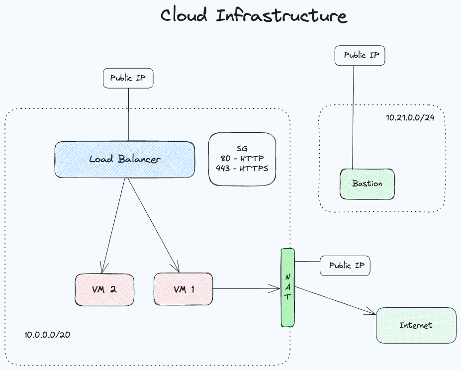
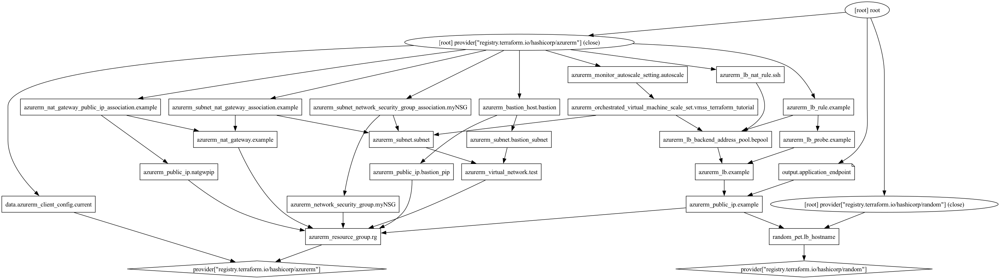

# Projeto Final INF0554

## Arquitetura

A arquitetura do projeto é composta por uma aplicação web que é executada em um conjunto de máquinas virtuais. A aplicação web é acessada por usuários finais por meio de um balanceador de carga. O balanceador de carga distribui o tráfego entre as máquinas virtuais que executam a aplicação web. O conjunto de máquinas virtuais é gerenciado por um conjunto de escalas, que aumenta ou diminui o número de máquinas virtuais com base na carga da CPU.

Um Load Balancer foi criado para distribuir o tráfego entre as máquinas virtuais. O Load Balancer é um serviço que distribui o tráfego de entrada entre várias máquinas virtuais. O Load Balancer é um serviço de rede que distribui o tráfego de entrada entre várias máquinas virtuais. O Load Balancer é um serviço de rede que distribui o tráfego de entrada entre várias máquinas virtuais. O Load Balancer é um serviço de rede que distribui o tráfego de entrada entre várias máquinas virtuais. O Load Balancer é um serviço de rede que distribui o tráfego de entrada entre várias máquinas virtuais. O Load Balancer é um serviço de rede que distribui o tráfego de entrada entre várias máquinas virtuais. O Load Balancer é um serviço de rede que distribui o tráfego de entrada entre várias máquinas virtuais. O Load Balancer é um serviço de rede que distribui o tráfego de entrada entre várias máquinas virtuais. O Load Balancer é um serviço de rede que distribui o tráfego de entrada entre várias máquinas virtuais. O Load Balancer é um serviço de rede que distribui o tráfego de entrada entre várias máquinas virtuais. O Load Balancer é um serviço de rede que distribui o tráfego de entrada entre várias máquinas virtuais. O Load Balancer é um serviço de rede que distribui o tráfego de entrada entre várias máquinas virtuais.

Um Bastion host foi utilizado para acessar as máquinas virtuais. O Bastion host é um servidor que fornece acesso seguro a máquinas virtuais em uma rede privada. O Bastion host é um servidor que fornece acesso seguro a máquinas virtuais em uma rede privada. O Bastion host é um servidor que fornece acesso seguro a máquinas virtuais em uma rede privada. O Bastion host é um servidor que fornece acesso seguro a máquinas virtuais em uma rede privada. O Bastion host é um servidor que fornece acesso seguro a máquinas virtuais em uma rede privada. O Bastion host é um servidor que fornece acesso seguro a máquinas virtuais em uma rede privada. O Bastion host é um servidor que fornece acesso seguro a máquinas virtuais em uma rede privada. O Bastion host é um servidor que fornece acesso seguro a máquinas virtuais em uma rede privada. O Bastion host é um servidor que fornece acesso seguro a máquinas virtuais em uma rede privada. O Bastion host é um servidor que fornece acesso seguro a máquinas virtuais em uma rede privada. O Bastion host é um servidor que fornece acesso seguro a máquinas virtuais em uma rede privada. O Bastion host é um servidor que fornece acesso seguro a máquinas virtuais em uma rede privada.

Além disto, tivemos que configurar um NAT Gateway com IP público para permitir que as máquinas virtuais acessem a internet. O NAT Gateway é um serviço que permite que as máquinas virtuais em uma rede privada acessem a internet. O NAT Gateway é um serviço que permite que as máquinas virtuais em uma rede privada acessem a internet. O NAT Gateway é um serviço que permite que as máquinas virtuais em uma rede privada acessem a internet. O NAT Gateway é um serviço que permite que as máquinas virtuais em uma rede privada acessem a internet. O NAT Gateway é um serviço que permite que as máquinas virtuais em uma rede privada acessem a internet. O NAT Gateway é um serviço que permite que as máquinas virtuais em uma rede privada acessem a internet. O NAT Gateway é um serviço que permite que as máquinas virtuais em uma rede privada acessem a internet. O NAT Gateway é um serviço que permite que as máquinas virtuais em uma rede privada acessem a internet. O NAT Gateway é um serviço que permite que as máquinas virtuais em uma rede privada acessem a internet. O NAT Gateway é um serviço que permite que as máquinas virtuais em uma rede privada acessem a internet. O NAT Gateway é um serviço que permite que as máquinas virtuais em uma rede privada acessem a internet e façam o download da aplicação direto do GitHub.



## Applicação Demo

A aplicação demo é um site simples que exibe uma página HTML. A aplicação é executada em um servidor web Apache. O servidor web Apache é um servidor web de código aberto que é amplamente utilizado para hospedar sites e aplicativos web. O servidor web Apache é executado em um servidor virtual que é gerenciado por um conjunto de escalas.

Na geração do HTML da página web, uma sequência de curls é realizada para o servidor de metadados da Azure, que retorna informações sobre a máquina virtual em que a aplicação está sendo executada. Essas informações são exibidas na página web.

## Criação da Infraestrutura

Para criar a infraestrutura, foi utilizado o Terraform. O Terraform é uma ferramenta de infraestrutura como código (IaC) que permite criar, alterar e versionar a infraestrutura de forma segura e eficiente. O Terraform permite que a infraestrutura seja descrita em um arquivo de configuração que define quais recursos devem ser provisionados e como eles devem ser configurados.

Primeiramente precisamos fazer login na Azure:

```
az login
```

Em seguida, inicializamos o Terraform:

```
terraform init
```

E então, aplicamos o plano:

```
terraform apply
```

Grafo de recursos:



## AutoScaling

Para realizar o auto scaling de uma aplicação, é necessário monitorar a utilização de recursos da aplicação e, a partir disso, decidir se é necessário aumentar ou diminuir a quantidade de instâncias da aplicação. Para isso, é necessário definir métricas que serão monitoradas e definir regras para decidir quando aumentar ou diminuir a quantidade de instâncias.

Na Azure, o serviço que realiza o auto scaling é o Azure Monitor. O Azure Monitor é um serviço de monitoramento de nuvem unificado que fornece análises abrangentes em tempo real, retenção de dados de longo prazo e alertas com base em métricas. O Azure Monitor coleta dados de telemetria de uma variedade de fontes e fornece uma experiência unificada para visualização, pesquisa, análise e alerta.

A seguir, será apresentado um exemplo de como realizar o auto scaling de uma aplicação na Azure.

```
rule {
    metric_trigger {
        metric_name     = "Percentage CPU"
            metric_resource_id = azurerm_orchestrated_virtual_machine_scale_set.vmss_terraform_tutorial.id
        operator        = "LessThan"
        statistic       = "Average"
        time_aggregation   = "Average"
        time_window     = "PT2M"
        time_grain      = "PT1M"
        threshold       = 10
    }
    scale_action {
        direction = "Decrease"
        type    = "ChangeCount"
        value   = "1"
        cooldown  = "PT1M"
    }
}
rule {
    metric_trigger {
        metric_name     = "Percentage CPU"
        metric_resource_id = azurerm_orchestrated_virtual_machine_scale_set.vmss_terraform_tutorial.id
        operator        = "GreaterThan"
        statistic       = "Average"
        time_aggregation   = "Average"
        time_window     = "PT2M"
        time_grain      = "PT1M"
        threshold       = 90
}
    scale_action {
        direction = "Increase"
        type    = "ChangeCount"
        value   = "1"
        cooldown  = "PT1M"
    }
}
```

Essas duas regras instruem o conjunto de escalas a adicionar uma VM quando a carga média da CPU for superior a 90% e a remover uma VM quando for inferior a 10%. O parâmetro scale_action em cada regra de autoescala configura o conjunto de escalas para adicionar ou remover apenas uma VM por vez, e o parâmetro cooldown configura o conjunto de escalas para aguardar um minuto entre as ações de escalonamento. Lembre-se de que o perfil de autoescala que você criou na etapa anterior garante um mínimo de 1 e um máximo de 10 máquinas virtuais em execução.

## Limitações

a) O Azure Monitor não suporta a definição de regras de autoescala com base em métricas personalizadas. Isso significa que você não pode definir regras de autoescala com base em métricas que não são fornecidas pelo Azure Monitor.
b) AutoScaling apenas por métricas de CPU ou memória.

Alternativas:

a) Usar o Azure Functions para criar uma função que monitora a métrica personalizada e, em seguida, chama a API de gerenciamento do Azure para aumentar ou diminuir a quantidade de instâncias da aplicação.
b) KEDA (Kubernetes-based Event-Driven Autoscaling) é uma solução de autoescala baseada em Kubernetes que permite escalar automaticamente aplicativos baseados em Kubernetes com base em eventos.

## Limpar a Infraestrutura

Para limpar a infraestrutura, basta executar o comando:

```
terraform destroy
```
