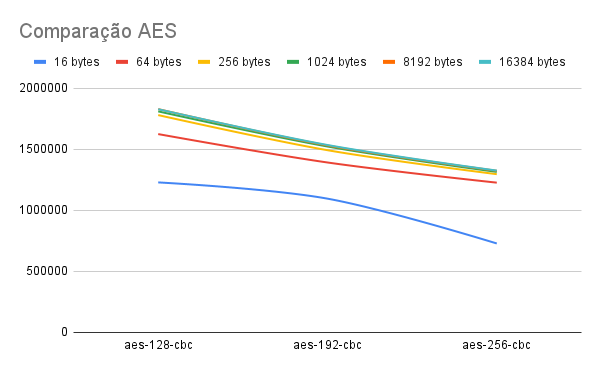

# Desempenho

Neste exercício iremos avaliar as diferenças de desempenho entre algoritmos simétricos e assimétricos.

## Criando benchmark

Podemos utilizar o comando a seguir para fazer um benchmark utilizando AES e RSA com diferentes tamanhos de blocls.

```sh
openssl speed aes rsa
Doing aes-128-cbc ops for 3s on 16 size blocks: 230434897 aes-128-cbc ops in 3.00s
Doing aes-128-cbc ops for 3s on 64 size blocks: 76163081 aes-128-cbc ops in 3.00s
Doing aes-128-cbc ops for 3s on 256 size blocks: 20794202 aes-128-cbc ops in 2.99s
Doing aes-128-cbc ops for 3s on 1024 size blocks: 5287383 aes-128-cbc ops in 2.99s
Doing aes-128-cbc ops for 3s on 8192 size blocks: 667671 aes-128-cbc ops in 2.99s
Doing aes-128-cbc ops for 3s on 16384 size blocks: 333717 aes-128-cbc ops in 2.99s
Doing aes-192-cbc ops for 3s on 16 size blocks: 204799631 aes-192-cbc ops in 2.99s
Doing aes-192-cbc ops for 3s on 64 size blocks: 65039558 aes-192-cbc ops in 2.99s
Doing aes-192-cbc ops for 3s on 256 size blocks: 17435403 aes-192-cbc ops in 2.99s
Doing aes-192-cbc ops for 3s on 1024 size blocks: 4447412 aes-192-cbc ops in 2.99s
Doing aes-192-cbc ops for 3s on 8192 size blocks: 560912 aes-192-cbc ops in 3.00s
Doing aes-192-cbc ops for 3s on 16384 size blocks: 280215 aes-192-cbc ops in 2.99s
Doing aes-256-cbc ops for 3s on 16 size blocks: 136644866 aes-256-cbc ops in 3.00s
Doing aes-256-cbc ops for 3s on 64 size blocks: 57324735 aes-256-cbc ops in 2.99s
Doing aes-256-cbc ops for 3s on 256 size blocks: 15192634 aes-256-cbc ops in 3.00s
Doing aes-256-cbc ops for 3s on 1024 size blocks: 3840122 aes-256-cbc ops in 2.99s
Doing aes-256-cbc ops for 3s on 8192 size blocks: 481639 aes-256-cbc ops in 2.98s
Doing aes-256-cbc ops for 3s on 16384 size blocks: 242779 aes-256-cbc ops in 3.00s
Doing 512 bits private rsa sign ops for 10s: 590650 512 bits private RSA sign ops in 9.97s
Doing 512 bits public rsa verify ops for 10s: 6768380 512 bits public RSA verify ops in 9.97s
Doing 512 bits private rsa encrypt ops for 10s: 5851930 512 bits public RSA encrypt ops in 9.96s
Doing 512 bits private rsa decrypt ops for 10s: 489881 512 bits private RSA decrypt ops in 9.98s
Doing 1024 bits private rsa sign ops for 10s: 119416 1024 bits private RSA sign ops in 9.96s
Doing 1024 bits public rsa verify ops for 10s: 2583511 1024 bits public RSA verify ops in 9.96s
Doing 1024 bits private rsa encrypt ops for 10s: 2351927 1024 bits public RSA encrypt ops in 9.87s
Doing 1024 bits private rsa decrypt ops for 10s: 113183 1024 bits private RSA decrypt ops in 9.91s
Doing 2048 bits private rsa sign ops for 10s: 19130 2048 bits private RSA sign ops in 9.90s
Doing 2048 bits public rsa verify ops for 10s: 764081 2048 bits public RSA verify ops in 9.87s
Doing 2048 bits private rsa encrypt ops for 10s: 739343 2048 bits public RSA encrypt ops in 9.89s
Doing 2048 bits private rsa decrypt ops for 10s: 18992 2048 bits private RSA decrypt ops in 9.95s
Doing 3072 bits private rsa sign ops for 10s: 6615 3072 bits private RSA sign ops in 9.95s
Doing 3072 bits public rsa verify ops for 10s: 357330 3072 bits public RSA verify ops in 9.93s
Doing 3072 bits private rsa encrypt ops for 10s: 349643 3072 bits public RSA encrypt ops in 9.94s
Doing 3072 bits private rsa decrypt ops for 10s: 6596 3072 bits private RSA decrypt ops in 9.95s
Doing 4096 bits private rsa sign ops for 10s: 3014 4096 bits private RSA sign ops in 9.95s
Doing 4096 bits public rsa verify ops for 10s: 207652 4096 bits public RSA verify ops in 9.95s
Doing 4096 bits private rsa encrypt ops for 10s: 204206 4096 bits public RSA encrypt ops in 9.95s
Doing 4096 bits private rsa decrypt ops for 10s: 3005 4096 bits private RSA decrypt ops in 9.95s
Doing 7680 bits private rsa sign ops for 10s: 368 7680 bits private RSA sign ops in 9.97s
Doing 7680 bits public rsa verify ops for 10s: 60435 7680 bits public RSA verify ops in 9.93s
Doing 7680 bits private rsa encrypt ops for 10s: 60387 7680 bits public RSA encrypt ops in 9.97s
Doing 7680 bits private rsa decrypt ops for 10s: 369 7680 bits private RSA decrypt ops in 9.98s
Doing 15360 bits private rsa sign ops for 10s: 69 15360 bits private RSA sign ops in 10.01s
Doing 15360 bits public rsa verify ops for 10s: 15534 15360 bits public RSA verify ops in 9.98s
Doing 15360 bits private rsa encrypt ops for 10s: 15398 15360 bits public RSA encrypt ops in 9.98s
Doing 15360 bits private rsa decrypt ops for 10s: 69 15360 bits private RSA decrypt ops in 10.01s
version: 3.2.1
built on: Tue Jan 30 13:14:56 2024 UTC
options: bn(64,64)
compiler: clang -fPIC -arch arm64 -O3 -Wall -DL_ENDIAN -DOPENSSL_PIC -D_REENTRANT -DOPENSSL_BUILDING_OPENSSL -DNDEBUG
CPUINFO: OPENSSL_armcap=0x987d
The 'numbers' are in 1000s of bytes per second processed.
type             16 bytes     64 bytes    256 bytes   1024 bytes   8192 bytes  16384 bytes
aes-128-cbc    1228986.12k  1624812.39k  1780373.15k  1810796.05k  1829284.56k  1828635.23k
aes-192-cbc    1095917.76k  1392151.07k  1492797.05k  1523127.05k  1531663.70k  1535465.74k
aes-256-cbc     728772.62k  1227017.74k  1296438.10k  1315145.46k  1324022.38k  1325897.05k
                   sign    verify    encrypt   decrypt   sign/s verify/s  encr./s  decr./s
rsa   512 bits 0.000017s 0.000001s 0.000002s 0.000020s  59242.7 678874.6 587543.2  49086.3
rsa  1024 bits 0.000083s 0.000004s 0.000004s 0.000088s  11989.6 259388.7 238290.5  11421.1
rsa  2048 bits 0.000518s 0.000013s 0.000013s 0.000524s   1932.3  77414.5  74756.6   1908.7
rsa  3072 bits 0.001504s 0.000028s 0.000028s 0.001508s    664.8  35984.9  35175.4    662.9
rsa  4096 bits 0.003301s 0.000048s 0.000049s 0.003311s    302.9  20869.5  20523.2    302.0
rsa  7680 bits 0.027092s 0.000164s 0.000165s 0.027046s     36.9   6086.1   6056.9     37.0
rsa 15360 bits 0.145072s 0.000642s 0.000648s 0.145072s      6.9   1556.5   1542.9      6.9
```

## a. Comparando AES

Podemos criar um gráfico baseado nos resultados do comando anterior e analisar o comportamento do algoritmo simétrico AES com diferentes tamanhos de blocos.



Todos os três tipos de AES testatdos oferecem um balanço entre performance e segurança e são muito utilizados em prática. O AES-192 e AES-256 promovem maiores níveis de segurança por utilizarem mais bits na chave, porém a diferença em segurança pode não ser significamente relevante para muitas aplicações, particularmente o AES-256, que como podemos notar através do gráfico a cima, possui uma performance bastante inferior se comparado aos outros. A escolha entre AES-128, AES-192 e AES-256 dependem dos requisitos específicos de cada aplicação e devem levar em consideração os níveis de seguranca e performance.

## b. Comparando o RSA private

Podemos criar um gráfico baseado nos resultados do comando anterior e analisar o comportamento do algoritmo assimétrico RSA com diferentes tamanhos de chave.

")

Em termos de segurança, a resistência do RSA está diretamente relacionada ao tamanho da chave utilizada, onde tamanhos maiores de chave oferecem uma proteção mais robusta contra ataques criptográficos, como a fatoração de inteiros. Por outro lado, o desempenho do RSA é influenciado pelo tamanho da chave, sendo que chaves maiores tendem a exigir mais recursos computacionais para operações de criptografia e descriptografia, resultando em um impacto negativo na performance, especialmente em sistemas com recursos limitados.

## c. Comparando o RSA public

")

Podemos criar um gráfico baseado nos resultados do comando anterior e analisar o comportamento do algoritmo assimétrico RSA com diferentes tamanhos de chave.

## d. Comparação entre RSA private e public

No RSA, as operações de assinatura digital (RSA sign) e criptografia (RSA encrypt) são usadas para propósitos diferentes.

RSA Sign (Assinatura RSA): Na assinatura RSA, a chave privada é usada para assinar digitalmente uma mensagem, gerando uma assinatura. Esta assinatura pode ser verificada por qualquer pessoa que tenha acesso à chave pública correspondente. A assinatura digital garante a autenticidade, integridade e não repúdio da mensagem.

RSA Encrypt (Criptografia RSA): Na criptografia RSA, a chave pública é usada para criptografar uma mensagem, tornando-a inacessível para qualquer pessoa que não possua a chave privada correspondente. A mensagem pode então ser decifrada usando a chave privada correspondente. A criptografia RSA é usada para garantir a confidencialidade dos dados.

Em relação à performance, segundo os dados observados nos gráficos, a operação de criptografia RSA (encrypt) é mais lenta do que a operação de assinatura RSA (sign). Isso ocorre porque a operação de criptografia RSA envolve a exponenciação modular de um grande número pela chave pública, o que pode ser computacionalmente intensivo, especialmente com chaves de tamanho maior. Por outro lado, a operação de assinatura RSA envolve a exponenciação modular de um hash da mensagem pela chave privada, que pode ser mais rápida do que a criptografia RSA devido à menor complexidade computacional do hash em comparação com a mensagem original. No entanto, é importante notar que o desempenho pode variar dependendo da implementação específica e do tamanho das chaves utilizadas.

## e. Comparação AES e RSA

Vamos comparar esses casos com os algoritmos RSA de 2048 e 4096 bits, que são amplamente utilizados atualmente. A partir dos resultados observados nos gráficos anteriores, notamos que:

1. **AES-128 (16 bytes) vs. RSA-2048**: Para criptografar pequenos dados, como chaves de sessão, o AES-128 tende a ser significativamente mais rápido do que o RSA-2048 para operações de criptografia e descriptografia.
2. **AES-192 (64 bytes) vs. RSA-2048**: Para dados de tamanho moderado, como arquivos pequenos, o AES-192 ainda é mais rápido que o RSA-2048, embora a diferença possa ser menos pronunciada em comparação com o caso AES-128.
3. **AES-256 (1024 bytes) vs. RSA-4096**: Ao lidar com grandes volumes de dados, como arquivos grandes ou comunicações de rede, o desempenho do AES-256 é notavelmente superior ao do RSA-4096. O AES-256 é mais eficiente para operações de criptografia e descriptografia devido ao seu design e ao tamanho menor das chaves em comparação com o RSA-4096.

Em geral, o AES tende a superar o RSA em termos de desempenho, especialmente para criptografia simétrica de grandes volumes de dados. No entanto, é importante ressaltar que a escolha entre AES e RSA também depende dos requisitos de segurança, flexibilidade e interoperabilidade do sistema específico.
