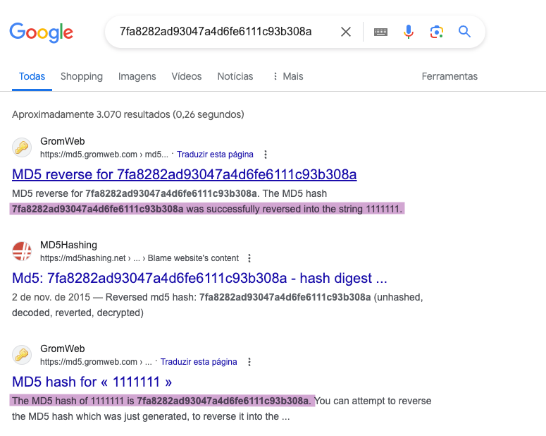

# Hash

Neste exercício iremos estudar o impacto do uso de funções hash sem salt para o armazenamento de senhas.

## a. Escolhendo senhas

A partir de uma lista de usuários e senhas foram escolhidas as seguintes senhas:

```sh
$ tail -n 10 mirai-botnet.txt | awk '{ print $2 }'
1111111
1234
12345
54321
123456
7ujMko0admin
pass
meinsm
tech
fucker
```

## b. Calculando o hash

Para calcular o hash das senhas utilizando MD5 e SHA-1, utilizamos os seguintes comandos:

```sh
PASSWORDS=$(tail -n 10 mirai-botnet.txt | awk '{ print $2 }')
for PASS in $(echo "$PASSWORDS" | tr ' ' '\n'); do
    echo -n "$PASS" | openssl dgst -md5 
    echo -n "$PASS" | openssl dgst -sha1 
done

MD5(stdin)= 7fa8282ad93047a4d6fe6111c93b308a
SHA1(stdin)= 2ea6201a068c5fa0eea5d81a3863321a87f8d533
MD5(stdin)= 81dc9bdb52d04dc20036dbd8313ed055
SHA1(stdin)= 7110eda4d09e062aa5e4a390b0a572ac0d2c0220
MD5(stdin)= 827ccb0eea8a706c4c34a16891f84e7b
SHA1(stdin)= 8cb2237d0679ca88db6464eac60da96345513964
MD5(stdin)= 01cfcd4f6b8770febfb40cb906715822
SHA1(stdin)= 348162101fc6f7e624681b7400b085eeac6df7bd
MD5(stdin)= e10adc3949ba59abbe56e057f20f883e
SHA1(stdin)= 7c4a8d09ca3762af61e59520943dc26494f8941b
MD5(stdin)= 4203e8e192124c82386c9542da4b8b4d
SHA1(stdin)= 6401561d8326540f8d1be2112081432d8ddf62da
MD5(stdin)= 1a1dc91c907325c69271ddf0c944bc72
SHA1(stdin)= 9d4e1e23bd5b727046a9e3b4b7db57bd8d6ee684
MD5(stdin)= f985a3b18830f3566cdd29c242b53561
SHA1(stdin)= ce7987ef8225cc1a2699a07901f59de7f09bdfed
MD5(stdin)= d9f9133fb120cd6096870bc2b496805b
SHA1(stdin)= c95ee47689a0aaec70c3eb950244657722c69b1f
MD5(stdin)= aac0a9daa4185875786c9ed154f0dece
SHA1(stdin)= c177922cb7715a94aa4758eb140e08bfce4c5a04
```

## c. Buscando por digest



Sim, conseguimos encontrar as senhas a partir do digest com uma simples busca no Google. Utilizando hashes sem sal, senhas idênticas resultarão em hashes idênticos, o que significa que um atacante pode usar tabelas de hash pré-computadas (como rainbow tables) para encontrar rapidamente as senhas correspondentes a hashes conhecidos.

## d. Melhorando os resultados

Utilizando o seguinte Google Dork, podemos pesquisar por arquivos de log contendo username e password. Entrando em um dos resultados, conseguimos fazer o download de um logs.

```
# Google Dork: filetype:log username admin
# Files Containing Passwords
# Date: 09/009/2021 
# Exploit Author: Rohit Singh
```

Mostrando parte do conteúdo:
```
2022-09-28 16:08:28.768  INFO 42 --- [http-nio-8080-exec-1,f0839d1f371245ee,bcce0a03eb41] c.a.o.server.trace.RequestTracingAspect  : API: [POST /api/v2/compute/hosts/batchCreate?null, client=192.168.18.198, traceId=f0839d1f371245ee, method=IterableResponse com.alipay.ocp.server.controller.ComputeController.batchCreateHost(BatchCreateHostRequest), args=BatchCreateHostRequest(hostBasicDataList=[BatchCreateHostRequest.HostBasicData(serialNumber=null, innerIpAddress=192.168.3.212)], sshPort=22, kind=DEDICATED_PHYSICAL_MACHINE, publishPorts=null, idcId=1, vpcId=1, typeId=1, credentialId=1, alias=null, description=null),]
2022-09-28 16:08:28.779  INFO 42 --- [http-nio-8080-exec-1,f0839d1f371245ee,bcce0a03eb41] c.a.o.s.common.DistributedLockAspect     : Get distributed lock, lockKey=batch-create-host-1122989598, method=batchCreateHost
2022-09-28 16:08:28.837  INFO 42 --- [pool-79-thread-1,f0839d1f371245ee,797f6e75bc37] c.o.o.e.internal.template.SshTemplate    : SSH execute begin: echo 1 on 192.168.3.212
2022-09-28 16:08:28.888  INFO 42 --- [pool-79-thread-1,f0839d1f371245ee,797f6e75bc37] c.o.o.e.internal.template.SshTemplate    : SSH execute end: echo 1 on 192.168.3.212, status 0,result:SshResponse(host=192.168.3.212, username=admin, command=echo 1, out=1
2022-09-28 16:08:28.889  INFO 42 --- [pool-79-thread-1,f0839d1f371245ee,797f6e75bc37] c.o.o.e.i.connector.ConnectorHolder      : [ConnectorHolder]:connector is evicted from holder's cache. cause=EXPLICIT, key=ConnectorKey(protocol=ssh, hostAddress=192.168.3.212, httpPort=null, sshPort=22, authentication=Authentication(httpAuth=null, sshAuth=SshAuthentication(authType=password, passwordAuthConfig=PasswordAuthConfig(username=admin), privateKeyAuthConfig=null)), posConfig=PosConfig(downloadUrl=http://localhost:8080/api/v2/files/built-in/pos.py, sha1Sum=94c5350f98ba9dbb847f4943bb7bf33190d8003c), proxy=null)
2022-09-28 16:08:28.999  INFO 42 --- [pool-79-thread-1,f0839d1f371245ee,797f6e75bc37] c.o.o.e.i.connector.ConnectorHolder      : [ConnectorHolder]: connector put to cache, key=ConnectorKey(protocol=ssh, hostAddress=192.168.3.212, httpPort=null, sshPort=22, authentication=Authentication(httpAuth=null, sshAuth=SshAuthentication(authType=password, passwordAuthConfig=PasswordAuthConfig(username=admin), privateKeyAuthConfig=null)), posConfig=PosConfig(downloadUrl=http://localhost:8080/api/v2/files/built-in/pos.py, sha1Sum=94c5350f98ba9dbb847f4943bb7bf33190d8003c), proxy=null), estimated size:1
...
```

Ao investigar os logs, notamos que o sistema está utilizando SHA1 para as senhas. Podemos rodar algumas buscas no arquivo utilizando os hash gerados no item anterior (c).

Utilizando o hash das 10 senhas não foi possivel encontrar nenhum match dentro deste arquivo. Podemos concluir que ou o SHA1 pode estar usando salt ou que não testamos senhas suficientes para encontrar um match.

Um atacante poderia continuar esse processo até descobrir um sistema vulnerável e encontrar a senha dos usuários.
